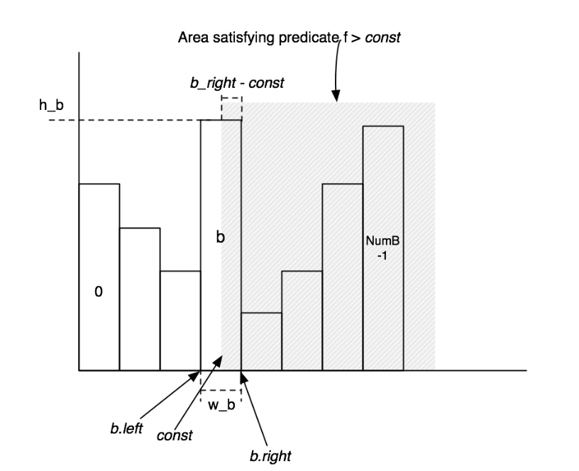
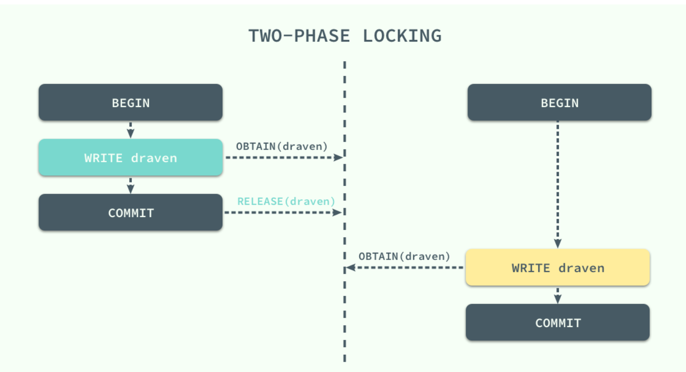

### 6.830小结

#### 写在前面

> 老规矩，扔个仓库链接： https://github.com/hangshuaibi/Simple-DB (bug-not-fix分支)

断断续续做了三周左右，虽然留了不少坑（目测两个测试还没过），但也算是把6.830给水完了。如其名，`Simple-DB`还是比较之Simple的，基本上就是根据每个Lab的提示填一些逻辑。一开始是想通过`Reading Assignment`锻炼下英语阅读能力，事实上靠着上学期数据库原理的老本也勉强能写大部分的练习... 本来写Lab过程中还是做了一些笔记的，但由于电脑原因丢失了这部分文件，所以只能照着自己浅薄的记忆做下记录，希望能对自己有所启发。

本文试图总结写Lab过程中的一些想法和心得，大致会包括`Java`和数据库的一些基础知识。

#### Java相关

##### String

- `intern()`
- 关于字符串的拼接
  - `StringBuilder`
  - `StringBuffer`

##### synchronized

- `static` method signature
- `non-static` method signature

- synchronized(this) inside method body

##### equals vs ==

> 如果在实现equals需要做cast操作，注意ClassCastException

##### Iterator

> 最好不要做`next`操作之前一定会调用`hasNext`的假定（鲁棒性）

##### ConcurrencyModificationException

>  Reference： https://docs.oracle.com/javase/7/docs/api/java/util/ConcurrentModificationException.html 
>
> Note that this exception does not always indicate that an object has been concurrently modified by a *different* thread. If a single thread issues a sequence of method invocations that violates the contract of an object, the object may throw this exception. For example, if a thread modifies a collection directly while it is iterating over the collection with a fail-fast iterator, the iterator will throw this exception. 

除了字面上意思上的多线程修改同一数据结构，当你在iteration的时候remove也会出问题，这个可以通过`iterator.remove()`或者其他手法避免问题。参见：https://stackoverflow.com/a/10432084

### Database

#### Query Optimization

查询优化简单点可以认为是在各种`query plan`里面找一个`best plan`，比如多表join寻找最佳的join顺序（不同顺序生成的临时表大小是不同的），那势必需要对各个plan进行性能的权衡。同时，如果估价的过程时空复杂度过高，反而会对性能产生负面影响。换言之，需要对操作进行一些简单的估价。

##### Selectivity

针对`LessThan`、`Equal`、`GreaterThan`、`LessThanOrEqual`、`GreaterThanOrEqual`等操作符，对某个表做过滤后的tuple数量进行估计。

估价函数基于直方图，示意图如下：




这里有个权衡是桶数量的分配，越多意味着每个桶的区间越小，结果也会相对精确。

一般而言需要对表进行多次扫描，比如第一遍扫描记录最大和最小，表大小等信息确定桶的分配，第二遍将元组入桶。另外，这种做法一般需要对表的每个列都进行相应的直方图构建，一个表的所有直方图都放在对应的`TableStat`内。

##### Join Optimizer( Selinger optimizer )

首先是估计join需要的cost以及cardinality(生成元组数)，根据这些信息对多表join的多个plan进行估价。

接下来就是plan的枚举，这个搬运下lab 3的内容：

```shell
1. j = set of join nodes
2. for (i in 1...|j|):
3.     for s in {all length i subsets of j}
4.       bestPlan = {}
5.       for s' in {all length d-1 subsets of s}
6.            subplan = optjoin(s')
7.            plan = best way to join (s-s') to subplan
8.            if (cost(plan) < cost(bestPlan))
9.               bestPlan = plan
10.      optjoin(s) = bestPlan
11. return optjoin(j)
```

基本上就是翻译代码，毕竟`helper function`给的挺多。

#### Buffer Pool

##### Concepts

- DbFile

  代表数据库的一个table。`DbFile`是一个interface，lab中实现了`HeapFile`，底层采用真实的文件存储，读写时以Page为单位，可调用`RandomAccessFile`的接口。

- Page

  一个DbFile包含了多个Page，一个Page存储多个tuple。物理存储和缓存以页面作为基本单位。

缓冲的基本单位是`Page`，Buffer Pool提供访问某页面的用户接口。

- 当被访问的某个页面已经被cache时，直接返回
- 当未被cache时，Buffer Pool调用DbFile的接口读取页面
- 当缓冲池已满时，需要把某些页面`evict`出缓冲池

事实上事务机制也是基于缓冲池去搭建的，后面会详细展开。

#### Transaction And Concurrency

事务机制算是感觉收获比较大的一部分，下面整理下自己的思路。

前面提到事务机制和缓冲池联系比较紧密，因为获取页面的用户接口是由缓冲池提供的，相当于是一个**唯一的全局访问点**，所以锁机制的逻辑可以在这里做。

##### Concepts

- 二阶段锁

  锁机制基于二阶段锁，一个事务在其生命周期内有两个阶段，**加锁阶段和解锁阶段**。实现中解锁只会在事务提交或者Abort时才会执行。

- 事务

  事务即一连串的对数据库的操作，意味着你在这个过程中可能需要fetch多个页面的数据。为了支持并发操作并且保证数据一致性，我们需要借助锁机制来实现。

- 锁的粒度

  lab建议锁的粒度是tuple或者page，并且Exercise和Test更偏向page粒度。理论上来说，粒度越小对并发度更友好，但逻辑应该会更加复杂。考虑到缓冲池以页面为单位进行缓冲和实现的复杂性，还是毅然决然选择了页面粒度进行锁机制的实现。

- 锁类型

  共享锁和互斥锁，取决于对页面是进行读写还是只读，只读可共享，读写需要进行互斥。这里也联想起课本中读优先和写优先之类的问题，理论上来说，在此也是可以实现的。

- 死锁

  二阶段锁存在的一个问题是死锁的出现，考虑以下情况，事务1获取页面1（成功），事务2获取页面2（成功）；接着事务1获取页面2，事务2获取页面1，这就出现了所谓的资源循环依赖，这部分算法实现会在后面补上。

  

- 什么时候对页面`markDirty()`

  在用户获取后用户手动进行标记，或者获取页面时判断读写权限进行标记，存在的问题是比如`seqscan`这种可能读写也可能只读，所以用户手动标记可能会更精确，事实上这部分在实现中也碰到了一些问题。

- 事务回滚与提交

  众所周知，事务在提交之前，如果发生了某些异常，可以对操作进行撤销，并且该撤销动作最好是透明的，通过缓冲池我们可以支持简单的**事务回滚**。

  - 在对一个页面进行修改后，我们把其标记为`dirty`
  - NO STEAL，这个指的是`evict`页面的过程中，**如果一个页面是dirty的，那么不要将其替换**。只有当一个事务commit之后，也即把缓冲池的内容写入磁盘后，我们才将其dirty标志清除。这样对页面的操作才可以进行undo。这是事务回滚得以支持的重要原则。
  - 那么接下来就是`transactionComplete`这个函数了，有两种情况：
    - 事务提交，将脏页面flush到磁盘，释放持有的锁
    - 事务回滚，discard脏缓存页面，这样就是一次**撤销**操作，因为该事务的写不会对磁盘数据产生影响，最后释放持有的锁

事实上并发写到最后还是相当于变成了一个**串行写**，毕竟数据一致性我们还是要保证的。然而在我的实现中这部分的并发写控制还存在问题，鉴于糟糕的debug体验和匮乏的知识，我已经放弃了...

- 死锁检测算法

  这部分在[仓库]( https://github.com/hangshuaibi/Simple-DB/blob/bug-not-fix/DeadlockAlgorithm.md )已经挂出来了，也比较之naive，基于判断是否出现资源循环依赖进行死锁的检测，故在此也不过多赘述。

### Design Pattern

##### 状态模式

最近刚好也在学习设计模式，对各种`Operator`比如前面提到的`LessThan`、`Equal`等，相当于要进行逻辑的分发，而最直接的方式大概就是`if-else if-else if`，着实不太优美，虽然不是那么刚需，实现这些操作符也可以算是模仿了状态模式的一些手法，把每个操作符看成一个状态，实现各自的逻辑。

另外，或许`LessThanOrEqual`用`GreaterThan`操作符实现也算是某种意义上的**代理模式**吧，虽然一开始无脑用了`LessThan`+`Equal` --

### End

总体来说虽然`Simple-DB`非常之Simple，比如没有实现主键约束、一致性约束之类的我已经基本没有印象的概念，但还是感觉有所收获。

以上。