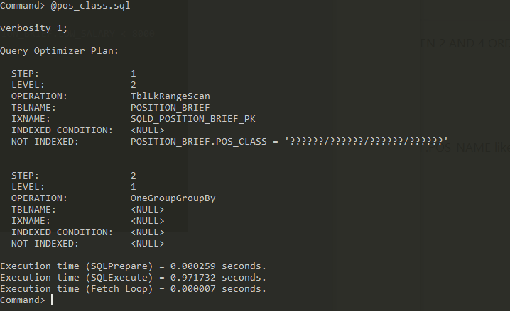
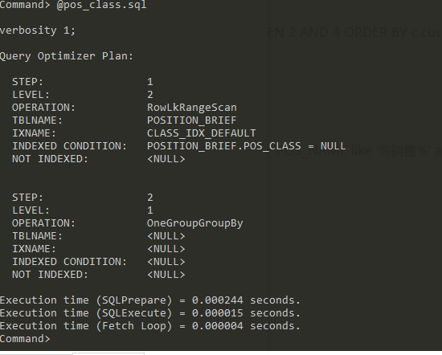
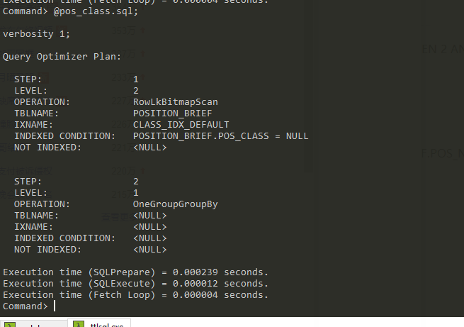
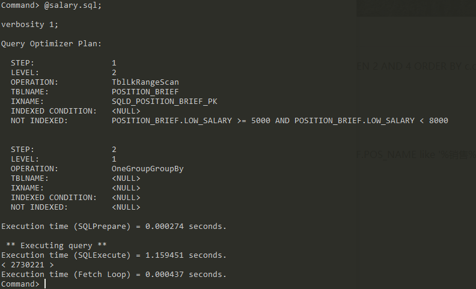
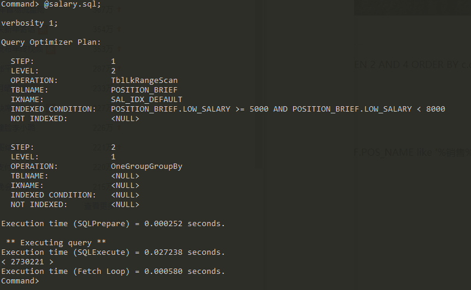
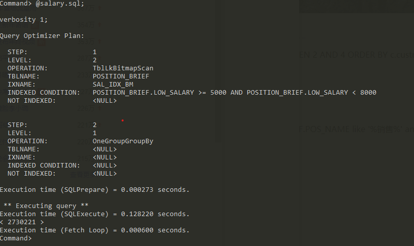

## 实验五 索引优化实验

### 实验方案

#### 针对招聘类别建立索引

##### Timesten


Timesten耗时及执行计划

```sql
select count(*) from position_brief where pos_class = '销售/客服/采购/淘宝';
```

###### 无索引



###### 范围索引




###### 位图索引



###### Timesten招聘类别索引小结

| 索引类型         | 查询操作  | 插入操作 |
| ---------------- | --------- | -------- |
| 无索引           | 971.991ms |          |
| 范围（默认）索引 | 0.259 ms  |          |
| 位图索引         | 0.251 ms  |          |

可以明显看出，建立索引相对于不建索引的查询的效率提升是十分明显的，此外，通过对`POS_CLASS`的对比也可以看出位图索引稍微优于范围索引，这正是因为这里执行的是判断条件是等值判断。

##### Oracle


**执行sql**

```sql
-- 常规查询：
select count(*) from position_brief where pos_class = '销售/客服/采购/淘宝';

-- 插入：
insert into POSITION_BRIEF(POS_ID, COM_ID,POS_CLASS,POS_NAME,POS_COUNT,
        POS_EDUCATION,POS_AGE,POS_EXPERIENCE,POS_SALARY,PAGE_PUBLISH_TIME,SITE_NAME)
         values(GC_POSITION_INC.nextval, 111,'销售/客服/采购/淘宝','小杨加湿',10,'小学',
                '20-23','三年','3000-5000','2019-09-08','Job速递');
commit;

-- 带null的查询：
select COUNT(*)
from POSITION_BRIEF
where POS_CLASS IS NULL OR POS_CLASS = '销售/客服/采购/淘宝'
```

###### 无索引

**查询操作**

耗时：1 s 299 ms

执行计划

```shell
Plan hash value: 43134281
 
-------------------------------------------------------------------------------------
| Id  | Operation          | Name           | Rows  | Bytes | Cost (%CPU)| Time     |
-------------------------------------------------------------------------------------
|   0 | SELECT STATEMENT   |                |     1 |    16 | 61697   (1)| 00:00:03 |
|   1 |  SORT AGGREGATE    |                |     1 |    16 |            |          |
|*  2 |   TABLE ACCESS FULL| POSITION_BRIEF |   406K|  6357K| 61697   (1)| 00:00:03 |
-------------------------------------------------------------------------------------
 
Predicate Information (identified by operation id):

```

**插入操作**

耗时：19 ms

----

###### 默认索引（B树）

```sql
create index idx_position_breif_default on POSITION_BRIEF(POS_CLASS);
```

**查询操作**

```sql
select count(*)
from POSITION
where POS_CLASS = '销售/客服/采购/淘宝'
```

耗时：170ms

执行计划：

```shell
Plan hash value: 3297133955
 
-------------------------------------------------------------------------------------
| Id  | Operation         | Name                       |Rows|Bytes|Cost(%CPU)| Time |
-------------------------------------------------------------------------------------
|   0 | SELECT STATEMENT  |                            | 1 |  16 | 1508 (1)|00:00:01|
|   1 |  SORT AGGREGATE   |                            | 1 |  16 |         |        |
|*  2 |   INDEX RANGE SCAN| IDX_POSITION_BREIF_DEFAULT |406K|6357K| 1508(1)|00:00:01|
-------------------------------------------------------------------------------------
```

**带null的查询**

> 不走索引

```sql
select COUNT(*)
from POSITION_BRIEF
where POS_CLASS IS NULL OR POS_CLASS = '销售/客服/采购/淘宝'
```

耗时：1s 297 ms

执行计划：

```shell
Plan hash value: 43134281
 
-------------------------------------------------------------------------------------
| Id  | Operation          | Name           | Rows  | Bytes | Cost (%CPU)| Time     |
-------------------------------------------------------------------------------------
|   0 | SELECT STATEMENT   |                |     1 |    16 | 61702   (1)| 00:00:03 |
|   1 |  SORT AGGREGATE    |                |     1 |    16 |            |          |
|*  2 |   TABLE ACCESS FULL| POSITION_BRIEF |   406K|  6357K| 61702   (1)| 00:00:03 |
-------------------------------------------------------------------------------------
```

**插入操作**

耗时：24 ms

---

###### 位图索引

```sql
create bitmap index idex_position_b_bitmap on POSITION_BRIEF(POS_CLASS)
```

索引建立耗时：1s 765ms

**查询操作**

耗时：86 ms

执行计划：

```shell
Plan hash value: 3633461285
 
-------------------------------------------------------------------------------------
| Id| Operation                  | Name                 |Rows| Bytes|Cost(%CPU)|Time|
-------------------------------------------------------------------------------------
| 0 |SELECT STATEMENT            |                      |  1 |  16  | 53(0)|00:00:01|
| 1 | SORT AGGREGATE             |                      |  1 |  16  |      |        |
| 2 |  BITMAP CONVERSION COUNT   |                      |406K| 6357K| 53(0)|00:00:01|
|*3 |   BITMAP INDEX SINGLE VALUE|IDEX_POSITION_B_BITMAP|    |      |      |        |
-------------------------------------------------------------------------------------
```

**插入操作**

耗时：23 ms

**存在null的查询**

耗时：53 ms

执行计划：

```
Plan hash value: 3604167573
 
-------------------------------------------------------------------------------------
|Id| Operation                | Name                 | Rows|Bytes|Cost(%CPU)| Time  |
-------------------------------------------------------------------------------------
|0 |SELECT STATEMENT            |                      |   1 |16 |  55  (0)|00:00:01|
|1 | SORT AGGREGATE             |                      |   1 |16 |         |        |
|2 |  BITMAP CONVERSION COUNT   |                      |2494K|38M|  55  (0)|00:00:01|
|3 |   BITMAP OR                |                      |     |   |         |        |
|*4|    BITMAP INDEX SINGLE VALUE|IDEX_POSITION_B_BITMAP|    |   |         |        |
|*5|    BITMAP INDEX SINGLE VALUE|IDEX_POSITION_B_BITMAP|    |   |         |        |
-------------------------------------------------------------------------------------
```

###### Oracle招聘类别索引小结

| 索引类型 | 查询操作 | 插入操作 | 带null的查询 |
| -------- | -------- | -------- | ------------ |
| 无索引   | 1299 ms  | 19 ms    | -            |
| B树索引  | 170 ms   | 24 ms    | 1297 ms      |
| 位图索引 | 86 ms    | 23 ms    | 53 ms        |

可以看到，对于（不带null的）查询操作来说，相比不建索引，B树索引和位图索引对查询效率提升很大，当然在插入方面会带来一些额外时间的损耗。

此外，我们可以看到位图索引在等值查询方面优于B树索引。另外，在where子句带null比较时，即使建立了B树索引，从查询的执行计划可以看出也是不走B树索引的，而是进行了一个全表扫描，因为B树索引不会记录空值(null)的信息。相比之下，由于位图索引记录了空值的信息，所以在查询带空值时也能合理利用索引提升查询效率。


#### 针对薪酬建立索引

##### Timesten


Timesten耗时及执行计划

```sql
select count(*) FROM POSITION_BRIEF 
WHERE low_salary >= 5000 and low_salary < 8000;
```

###### 无索引



###### 范围索引



###### 位图索引



###### Timesten招聘薪酬索引小结

| 索引类型         | 查询操作   | 插入操作 |
| ---------------- | ---------- | -------- |
| 无索引           | 1159.725ms |          |
| 范围（默认）索引 | 27.49 ms   |          |
| 位图索引         | 128.493 ms |          |

可以看出，建立索引后相对索引前的效率提升十分明显，另外，由于对于薪酬的查询是范围查询，所以范围索引相对位图索引会更占优势。

##### Oracle

Oracle耗时及执行计划

```sql
-- 查询
select COUNT(*)
from POSITION_BRIEF
where LOW_SALARY >= 5000 AND LOW_SALARY < 8000

-- 插入
insert into POSITION_BRIEF(POS_ID, COM_ID,POS_CLASS,POS_NAME,POS_COUNT,
        POS_EDUCATION,POS_AGE,POS_EXPERIENCE,POS_SALARY,PAGE_PUBLISH_TIME,SITE_NAME)
         values(GC_POSITION_INC.nextval, 111,'销售/客服/采购/淘宝','小杨加湿',10,
                '小学','20-23','三年','3000-5000','2019-09-08','Job速递');
commit;
```


##### 无索引

###### 查询操作

耗时：1 s 278 ms

执行计划：

```shell
Plan hash value: 43134281
 
-------------------------------------------------------------------------------------
| Id  | Operation          | Name           | Rows  | Bytes | Cost (%CPU)| Time     |
-------------------------------------------------------------------------------------
|   0 | SELECT STATEMENT   |                |     1 |     4 | 61656   (1)| 00:00:03 |
|   1 |  SORT AGGREGATE    |                |     1 |     4 |            |          |
|*  2 |   TABLE ACCESS FULL| POSITION_BRIEF |   246K|   962K| 61656   (1)| 00:00:03 |
-------------------------------------------------------------------------------------
 
Predicate Information (identified by operation id):

```

###### 插入操作

19 ms

---

##### B树索引

> 建立耗时：7 s 55 ms

###### 查询操作

耗时：165 ms - 222 ms

执行计划：

```shell
Plan hash value: 32581118
 
-------------------------------------------------------------------------------------
| Id  | Operation         | Name                     |Rows|Bytes|Cost(%CPU)| Time     |
-------------------------------------------------------------------------------------
|   0 | SELECT STATEMENT  |                          |   1|   4 |  487  (1)|00:00:01|
|   1 |  SORT AGGREGATE   |                          |   1|   4 |          |        |
|*  2 |   INDEX RANGE SCAN|IDX_POSITION_B_DEFAULT_SAL|246K| 962K|  487  (1)|00:00:01|
-------------------------------------------------------------------------------------
```

###### 插入操作

耗时：20 ms - 25 ms

---

##### 位图索引

> 索引建立耗时：2s 543ms

###### 查询操作

耗时：55 - 100 ms

执行计划：

```sql
Plan hash value: 2521356592
 
-------------------------------------------------------------------------------------
|Id | Operation                | Name                    |Rows|Bytes|Cost(%CPU)|Time|
-------------------------------------------------------------------------------------
| 0 |SELECT STATEMENT         |                         |  1 |   4 | 57 (0)|00:00:01|
| 1 | SORT AGGREGATE          |                         |  1 |   4 |       |        |
| 2 |  BITMAP CONVERSION COUNT|                         |246K| 962K| 57 (0)|00:00:01|
|*3 |   BITMAP INDEX RANGE SCAN|IDX_POSITION_B_BITMAP_SAL|   |     |       |        |

```

###### 插入操作

耗时：21 - 32 ms

查询计划：

```sql
Plan hash value: 202908843
 
----------------------------------------------------------------------------------
|Id | Operation               | Name          |Rows|Bytes |Cost (%CPU)| Time     |
----------------------------------------------------------------------------------
| 0 | INSERT STATEMENT        |               |   1|  155 |    1   (0)| 00:00:01 |
| 1 |  LOAD TABLE CONVENTIONAL|POSITION_BRIEF |    |      |           |          |
| 2 |   SEQUENCE              |GC_POSITION_INC|    |      |           |          |
----------------------------------------------------------------------------------
```


###### Oracle招聘薪酬索引小结

| 索引类型 | 查询操作 | 插入操作 |
| -------- | -------- | -------- |
| 无索引   | 1278 ms  | 19ms     |
| B树索引  | 170ms    | 23ms     |
| 位图索引 | 70ms     | 21ms     |

跟之前实验相同，建立索引对查询效率由很大提升。跟Timesten中的范围（薪酬）查询不同的是，位图索引在Oracle中更占优势。观察查询计划，在Oracle中，对于单点等值（招聘类别）查询和范围（薪酬）查询，B树索引和位图索引采用的索引策略是有很大区别的：

| 索引类型 | 单点等值（招聘类别）查询  | 范围（薪酬）查询        |
| -------- | ------------------------- | ----------------------- |
| 位图索引 | BITMAP INDEX SINGLE VALUE | BITMAP INDEX RANGE SCAN |
| B树索引  | INDEX RANGE SCAN          | INDEX RANGE SCAN        |

相对而言位图索引比较之智能，它会根据查询条件去调整自己的索引策略，使之更适合该次查询。但是在实际的使用中，B树索引是Oracle的默认索引，因为位图索引一般而言更适合基数更小也就是重复较多的列。

#### 针对薪酬和类别建立复合索引

Oracle的复合索引有一个**前导列**的概念，也就是在复合索引中的第一列，为更加合理地探究复合索引的工作原理，我们对薪酬和类别建立了复合索引，并调整了其先后顺序。

##### 无索引

###### 查询1

```sql
select
COUNT(*)
from POSITION_BRIEF
where
      (LOW_SALARY >= 5000 AND LOW_SALARY < 8000)
    and
      (POS_CLASS = '销售/客服/采购/淘宝')
```

耗时：1s 315 ms

执行计划：

```shell
Plan hash value: 43134281
 
-------------------------------------------------------------------------------------
| Id  | Operation          | Name           | Rows  | Bytes | Cost (%CPU)| Time     |
-------------------------------------------------------------------------------------
|   0 | SELECT STATEMENT   |                |     1 |    20 | 61698   (1)| 00:00:03 |
|   1 |  SORT AGGREGATE    |                |     1 |    20 |            |          |
|*  2 |   TABLE ACCESS FULL| POSITION_BRIEF |   771K|    14M| 61698   (1)| 00:00:03 |
-------------------------------------------------------------------------------------

```

###### 查询2

```sql
select
COUNT(*)
from POSITION_BRIEF
where
      (LOW_SALARY >= 5000 AND LOW_SALARY < 8000)
```

耗时：1 s 364 ms

执行计划：

```shell
Plan hash value: 43134281
 
-------------------------------------------------------------------------------------
| Id  | Operation          | Name           | Rows  | Bytes | Cost (%CPU)| Time     |
-------------------------------------------------------------------------------------
|   0 | SELECT STATEMENT   |                |     1 |     4 | 61656   (1)| 00:00:03 |
|   1 |  SORT AGGREGATE    |                |     1 |     4 |            |          |
|*  2 |   TABLE ACCESS FULL| POSITION_BRIEF |   246K|   962K| 61656   (1)| 00:00:03 |
-------------------------------------------------------------------------------------
```

###### 查询3

```sql
select
COUNT(*)
from POSITION_BRIEF
where (POS_CLASS = '销售/客服/采购/淘宝')
```

耗时：1s 268ms

执行计划：

```sql
Plan hash value: 43134281
 
-------------------------------------------------------------------------------------
| Id  | Operation          | Name           | Rows  | Bytes | Cost (%CPU)| Time     |
-------------------------------------------------------------------------------------
|   0 | SELECT STATEMENT   |                |     1 |    16 | 61697   (1)| 00:00:03 |
|   1 |  SORT AGGREGATE    |                |     1 |    16 |            |          |
|*  2 |   TABLE ACCESS FULL| POSITION_BRIEF |   406K|  6357K| 61697   (1)| 00:00:03 |
-------------------------------------------------------------------------------------
```


##### 索引1（LOW_SALARY为前导列）

```sql
create index idx_lsal_cla on POSITION_BRIEF(LOW_SALARY, POS_CLASS)
```

###### 查询1

```sql
select COUNT(*)
from POSITION_BRIEF
where
      (LOW_SALARY >= 5000 AND LOW_SALARY < 8000)
    and
      (POS_CLASS = '销售/客服/采购/淘宝')
```
耗时：287 ms

执行计划：

```shell
Plan hash value: 224891651
 
---------------------------------------------------------------------------------
| Id  | Operation        | Name         | Rows  | Bytes | Cost (%CPU)| Time     |
---------------------------------------------------------------------------------
|   0 | SELECT STATEMENT |              |     1 |    20 |  3391   (1)| 00:00:01 |
|   1 |  SORT AGGREGATE  |              |     1 |    20 |            |          |
|*  2 |   INDEX SKIP SCAN| IDX_LSAL_CLA |   703K|    13M|  3391   (1)| 00:00:01 |
---------------------------------------------------------------------------------
```

###### 查询 2

```sql
select COUNT(*)
from POSITION_BRIEF
where (LOW_SALARY >= 5000 AND LOW_SALARY < 8000);
```

耗时：216 ms

执行计划：

```shell
Plan hash value: 3954524975
 
----------------------------------------------------------------------------------
| Id  | Operation         | Name         | Rows  | Bytes | Cost (%CPU)| Time     |
----------------------------------------------------------------------------------
|   0 | SELECT STATEMENT  |              |     1 |     4 | 11269   (1)| 00:00:01 |
|   1 |  SORT AGGREGATE   |              |     1 |     4 |            |          |
|*  2 |   INDEX RANGE SCAN| IDX_LSAL_CLA |  2727K|    10M| 11269   (1)| 00:00:01 |
----------------------------------------------------------------------------------
```

###### 查询 3

```sql
select OUNT(*)
from POSITION_BRIEF
where (POS_CLASS = '销售/客服/采购/淘宝')
```

耗时：487 ms

执行计划：

```shell
Plan hash value: 3115221572
 
-------------------------------------------------------------------------------------
| Id  | Operation             | Name         | Rows  | Bytes | Cost (%CPU)| Time    |
-------------------------------------------------------------------------------------
|   0 | SELECT STATEMENT      |              |     1 |    16 | 11406   (1)| 00:00:01|
|   1 |  SORT AGGREGATE       |              |     1 |    16 |            |         |
|*  2 |   INDEX FAST FULL SCAN| IDX_LSAL_CLA |  2621K|    40M| 11406   (1)| 00:00:01|
-------------------------------------------------------------------------------------
```

##### 索引2(POS_CLASS为前导列)

```sql
create index idx_cla_lsal on POSITION_BRIEF(POS_CLASS, LOW_SALARY)
```

###### 查询1

```sql
select
COUNT(*)
from POSITION_BRIEF
where
      (LOW_SALARY >= 5000 AND LOW_SALARY < 8000)
    and
      (POS_CLASS = '销售/客服/采购/淘宝')
```

耗时：93 ms

执行计划：

```shell
Plan hash value: 3131054157
 
----------------------------------------------------------------------------------
| Id  | Operation         | Name         | Rows  | Bytes | Cost (%CPU)| Time     |
----------------------------------------------------------------------------------
|   0 | SELECT STATEMENT  |              |     1 |    20 |  3354   (1)| 00:00:01 |
|   1 |  SORT AGGREGATE   |              |     1 |    20 |            |          |
|*  2 |   INDEX RANGE SCAN| IDX_CLA_LSAL |   771K|    14M|  3354   (1)| 00:00:01 |
----------------------------------------------------------------------------------
```


###### 查询2

```sql
select COUNT(*)
from POSITION_BRIEF
where (LOW_SALARY >= 5000 AND LOW_SALARY < 8000)
```

耗时：881 ms

执行计划：

```shell
Plan hash value: 888447949
 
---------------------------------------------------------------------------------
| Id  | Operation        | Name         | Rows  | Bytes | Cost (%CPU)| Time     |
---------------------------------------------------------------------------------
|   0 | SELECT STATEMENT |              |     1 |     4 | 11377   (1)| 00:00:01 |
|   1 |  SORT AGGREGATE  |              |     1 |     4 |            |          |
|*  2 |   INDEX SKIP SCAN| IDX_CLA_LSAL |  2727K|    10M| 11377   (1)| 00:00:01 |
---------------------------------------------------------------------------------
```


###### 查询3

```sql
select COUNT(*)
from POSITION_BRIEF
where (POS_CLASS = '销售/客服/采购/淘宝')
```

耗时：231 ms

执行计划：

```shell
Plan hash value: 3131054157
 
----------------------------------------------------------------------------------
| Id  | Operation         | Name         | Rows  | Bytes | Cost (%CPU)| Time     |
----------------------------------------------------------------------------------
|   0 | SELECT STATEMENT  |              |     1 |    16 | 10833   (1)| 00:00:01 |
|   1 |  SORT AGGREGATE   |              |     1 |    16 |            |          |
|*  2 |   INDEX RANGE SCAN| IDX_CLA_LSAL |  2621K|    40M| 10833   (1)| 00:00:01 |
----------------------------------------------------------------------------------
```


###### 复合索引小结

经过实验观察不同前导列在不同过滤（where子句）条件下的执行策略和执行时间，得出下表：

| 索引类型                      | 组合过滤  | 通过薪酬过滤 | 通过招聘类别过滤 |
| ----------------------------- | --------- | ------------ | ---------------- |
| 无索引                        | 1s 315 ms | 1 s 364 ms   | 1s 268ms         |
| 复合索引1（薪酬为前导列）     | 261 ms    | 226 ms       | 548 ms           |
| 复合索引2（招聘类别为前导列） | 115 ms    | 659 ms       | 186 ms           |

从实验结果可以看出，无论是以薪酬或者招聘类别为前导列建立复合索引，都会对三种不同过滤条件的查询的效率提升有很大的帮助。

可以看到，查询计划中出现了`Index Skip Scan`操作，这是Oracle 9i之后提供的一种新的扫描方式， 它并不是使用语句中的谓词来限制搜索路径，而是通过探测索引查找前缀列的不同值来启动。然后，将这些不同的值中的每一个作为常规索引搜索的起点。结果是对单个索引进行几次单独的搜索，合并后可以消除前缀列的影响。实际上，索引是从第二层开始搜索的。 

| 索引类型                      | 组合过滤 | 通过薪酬过滤 | 通过招聘类别过滤 |
| ----------------------------- | ---- | ---- |--|
| 复合索引1（薪酬为前导列）     | **INDEX SKIP SCAN** | INDEX RANGE SCAN |INDEX FAST FULL SCAN|
| 复合索引2（招聘类别为前导列） | INDEX RANGE SCAN | **INDEX SKIP SCAN** |INDEX RANGE SCAN|

可以看到，当以招聘类别为前导列建立复合索引时，如果只通过非前导列薪酬进行过滤查询时，就会触发一次Index Skip Scan；

当以薪酬为前导列时，通过组合过滤进行查询时，也触发了一次Index Skip Scan。但是，仅使用招聘类别进行过滤时，并没有触发，这主要是因为薪酬列的基数过大，Index Skip Scan的代价可能较高，故而选择了全表快扫。

----

## 实验六 Oracle优化器索引选择策略

本实验中，我们分别对POS_CLASS和LOW_SALARY建立位图索引和B树索引，进行不同类型的SQL查询。

```sql
create index idx_position_b_default_sal on POSITION_BRIEF(LOW_SALARY);

create bitmap index idx_position_b_bitmap_sal on POSITION_BRIEF(POS_CLASS) ;
```

#### 单查询 1

```sql
select COUNT(*)
from POSITION_BRIEF
where (LOW_SALARY >= 5000 AND LOW_SALARY < 8000)
```

耗时：210 ms

执行计划：

```sql
Plan hash value: 32581118
 
--------------------------------------------------------------------------------------
|Id |Operation         |Name                      |Rows|Bytes| Cost (%CPU)| Time     |
--------------------------------------------------------------------------------------
|  0|SELECT STATEMENT  |                          |  1 |   4 |   487   (1)| 00:00:01 |
|  1| SORT AGGREGATE   |                          |  1 |   4 |            |          |
|* 2|  INDEX RANGE SCAN|IDX_POSITION_B_DEFAULT_SAL|246K| 962K|   487   (1)| 00:00:01 |
--------------------------------------------------------------------------------------
```

#### 单查询 2

```sql
select COUNT(*)
from POSITION_BRIEF
where (POS_CLASS = '销售/客服/采购/淘宝')
```

耗时：95 ms

执行计划：

```shell
Plan hash value: 18017436
 
--------------------------------------------------------------------------------------
|Id |Operation                  |Name                     |Rows|Bytes|Cost(%CPU)|Time|
--------------------------------------------------------------------------------------
|  0|SELECT STATEMENT           |                         |  1 |  16 | 53(0)|00:00:01|
|  1| SORT AGGREGATE            |                         |  1 |  16 |      |        |
|  2|  BITMAP CONVERSION COUNT  |                          |406K|6357K|53(0)|00:00:01|
|* 3|   BITMAP INDEX SINGLE VALUE|IDX_POSITION_B_BITMAP_SAL|   |     |      |        |
--------------------------------------------------------------------------------------
```

#### 复合查询

```sql
select COUNT(*)
from POSITION_BRIEF
where
      (LOW_SALARY >= 5000 AND LOW_SALARY < 8000)
    and
      (POS_CLASS = '销售/客服/采购/淘宝')
```

耗时：1s 400 ms

执行计划：

```
Plan hash value: 1730434923
 
-------------------------------------------------------------------------------------------------------------
|Id| Operation                      | Name                       | Rows  | Bytes | Cost (%CPU)| Time     |
-------------------------------------------------------------------------------------------------------------
|0 | SELECT STATEMENT               |                            |     1 |    20 |  1579   (1)| 00:00:01 |
| 1|  SORT AGGREGATE                |                            |     1 |    20 |            |          |
|*2|   VIEW                         | index$_join$_001           |  9853 |   192K|  1579   (1)| 00:00:01 |
|*3|    HASH JOIN                   |                            |       |       |            |          |
| 4|     BITMAP CONVERSION TO ROWIDS|                            |  9853 |   192K|    53   (0)| 00:00:01 |
|*5|      BITMAP INDEX SINGLE VALUE | IDX_POSITION_B_BITMAP_SAL  |       |       |            |          |
|*6|     INDEX RANGE SCAN           | IDX_POSITION_B_DEFAULT_SAL |  9853 |   192K|  1934   (1)| 00:00:01 |
-------------------------------------------------------------------------------------------------------------
```

#### 索引小结实验小结

可以看到，当只使用单列过滤条件查询时，Oracle会选择对应的索引。当进行组合查询时，Oracle会分别利用两个索引造出两个临时表，随后使用Hash join得出最终结果。

可以看出，针对这种单独建立索引的情况，复合查询的执行效率相对复合索引要低得多，甚至会比不建索引稍慢，这主要是因为多了一次Hash Join的操作。

----

## 实验七 多线程优化实验

#### 单表(POSITION)批量写入实验

| 线程数 | 1000条                     | 10000条                    |
| ------ | -------------------------- | -------------------------- |
| 1      | 2.248 s （444/(s*thread)） | 22.847 s（437/(s*thread)） |
| 2      | 1.31 s（381/(s*thread)）   | 13.635 s（366/(s*thread)） |
| 3      | 0.959 s（347/(s*thread)）  | 9.405 s（354/(s*thread)）  |
| 4      | 0.769 s（325/(s*thread)）  | 7.697 s（324/(s*thread)）  |
| 5      | 0.624 s（320/(s*thread)）  | 7.996 （250/(s*thread)）   |

#### 多线程优化实验小结

可以看到，在POSITION表中插入1000条或10000条数据时，多线程对速度提升都有一定的优化，但随着线程数的增多，优化的时间幅度会有所下降，这体现在，每个线程单位时间内平均的插入条数变少了。