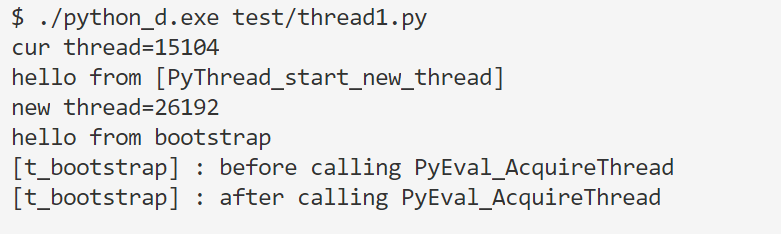

## Python中的多线程机制

#### GIL

在开始“深入”一些细节之前，先来探索下 GIL ，也就是 Global Interpreter Lock 。

> https://docs.python.org/3.7/c-api/init.html?highlight=gil#thread-state-and-the-global-interpreter-lock 
>
>  The Python interpreter is not fully thread-safe. In order to support multi-threaded Python programs, there’s a global lock, called the [global interpreter lock](https://docs.python.org/3.7/glossary.html#term-global-interpreter-lock) or [GIL](https://docs.python.org/3.7/glossary.html#term-gil), **that must be held by the current thread before it can safely access Python objects**. Without the lock, even the simplest operations could cause problems in a multi-threaded program: for example, when two threads simultaneously increment the reference count of the same object, the reference count could end up being incremented only once instead of twice. 

简单来说，一个 thread 在对一个 object 进行修改比如增减引用计数时需要 hold GIL。

这里也有个[有趣的问题]( https://stackoverflow.com/questions/26873512/why-does-python-provide-locking-mechanisms-if-its-subject-to-a-gil )，就是说为什么有了 GIL ，但 Python 还是会出现 data race 的现象。正如[轮子哥所说](https://www.zhihu.com/question/23030421/answer/23475843)：

> GIL也只是相当于古时候单核CPU通过不断的分配时间片来模拟多线程的方法而已，为什么那个时候写多线程也要用锁？ 

GIL 只能保证一条字节码的执行是原子的，而一些操作比如自增需要好几条字节码，故而会出现 data race 的现象。

##### TLS TSS
>
>  https://docs.python.org/3.7/c-api/init.html?highlight=gil#thread-specific-storage-tss-api 
>
>  TSS API is introduced to **supersede** the use of the existing TLS API within the CPython interpreter. This API uses a new type [`Py_tss_t`](https://docs.python.org/3.7/c-api/init.html?highlight=gil#c.Py_tss_t) instead of `int` to represent thread keys. 

##### 多进程插播（无关）

> https://docs.python.org/3/library/multiprocessing.html 
>
>  [`multiprocessing`](https://docs.python.org/3/library/multiprocessing.html#module-multiprocessing) is a package that supports spawning processes using an API similar to the [`threading`](https://docs.python.org/3/library/threading.html#module-threading) module. The [`multiprocessing`](https://docs.python.org/3/library/multiprocessing.html#module-multiprocessing) package offers both local and remote concurrency, effectively **side-stepping** the [Global Interpreter Lock](https://docs.python.org/3/glossary.html#term-global-interpreter-lock) by using subprocesses instead of threads. Due to this, the [`multiprocessing`](https://docs.python.org/3/library/multiprocessing.html#module-multiprocessing) module allows the programmer to **fully leverage multiple processors** on a given machine.  

#### 初见 Thread

Python 所提供的最基础的多线程机制的接口是 _thread module，由 C 实现。在此基础上，Python 提供了一个更高层的多线程机制接口 threading，以方便应用层面的多线程程序编写。这一块的重点也会重点探索 _thread 而不是 threading。

在 _threadmodule.c 中，提供的多线程机制的接口如下：

```c
static PyMethodDef thread_methods[] = {
    {"start_new_thread",        (PyCFunction)thread_PyThread_start_new_thread,
     METH_VARARGS, start_new_doc},
    {"start_new",               (PyCFunction)thread_PyThread_start_new_thread,
     METH_VARARGS, start_new_doc},
    {"allocate_lock",           (PyCFunction)thread_PyThread_allocate_lock,
     METH_NOARGS, allocate_doc},
    {"allocate",                (PyCFunction)thread_PyThread_allocate_lock,
     METH_NOARGS, allocate_doc},
    {"exit_thread",             (PyCFunction)thread_PyThread_exit_thread,
     METH_NOARGS, exit_doc},
    {"exit",                    (PyCFunction)thread_PyThread_exit_thread,
     METH_NOARGS, exit_doc},
    {"interrupt_main",          (PyCFunction)thread_PyThread_interrupt_main,
     METH_NOARGS, interrupt_doc},
    {"get_ident",               (PyCFunction)thread_get_ident,
     METH_NOARGS, get_ident_doc},
    {"_count",                  (PyCFunction)thread__count,
     METH_NOARGS, _count_doc},
    {"stack_size",              (PyCFunction)thread_stack_size,
     METH_VARARGS, stack_size_doc},
    {"_set_sentinel",           (PyCFunction)thread__set_sentinel,
     METH_NOARGS, _set_sentinel_doc},
    {NULL,                      NULL}           /* sentinel */
};
```

你可以通过 import _thread 引入该模块：

```c
static struct PyModuleDef threadmodule = {
    PyModuleDef_HEAD_INIT,
    "_thread",
    thread_doc,
    -1,
    thread_methods,
    NULL,
    NULL,
    NULL,
    NULL
};
```

#### 线程的创建

线程的创建也就是 thread_PyThread_start_new_thread ：

```c
static PyObject *
thread_PyThread_start_new_thread(PyObject *self, PyObject *fargs)
{
    PyObject *func, *args, *keyw = NULL;
    struct bootstate *boot;
    unsigned long ident;

    if (!PyArg_UnpackTuple(fargs, "start_new_thread", 2, 3,
                           &func, &args, &keyw))
        return NULL;
    if (!PyCallable_Check(func)) {
        PyErr_SetString(PyExc_TypeError,
                        "first arg must be callable");
        return NULL;
    }
    if (!PyTuple_Check(args)) {
        PyErr_SetString(PyExc_TypeError,
                        "2nd arg must be a tuple");
        return NULL;
    }
    if (keyw != NULL && !PyDict_Check(keyw)) {
        PyErr_SetString(PyExc_TypeError,
                        "optional 3rd arg must be a dictionary");
        return NULL;
    }
    printf("cur thread=%lu \n", PyThreadState_GET()->thread_id);//打印 6

    boot = PyMem_NEW(struct bootstate, 1);
    if (boot == NULL)
        return PyErr_NoMemory();
    boot->interp = PyThreadState_GET()->interp;
    boot->func = func;
    boot->args = args;
    boot->keyw = keyw;
    boot->tstate = _PyThreadState_Prealloc(boot->interp);
    ...
    Py_INCREF(func);
    Py_INCREF(args);
    Py_XINCREF(keyw);
    PyEval_InitThreads(); /* Start the interpreter's thread-awareness */
    ident = PyThread_start_new_thread(t_bootstrap, (void*) boot);
    ...

    printf("new thread=%lu \n", ident); // 打印 5
    return PyLong_FromUnsignedLong(ident);
}
```

首先是检查传进来的参数，分别是 callable 对象、参数打包后的 tuple 、可选的字典参数。

>  https://docs.python.org/3/library/_thread.html#_thread.start_new_thread 
>
> Start a new thread and return its identifier. The thread executes the function *function* with the argument list *args* (which must be a tuple). The optional *kwargs* argument specifies a dictionary of keyword arguments. 

注意 PyEval_InitThreads()  ，在首次创建线程时需要初始化 GIL （懒加载）。

> **Initialize and acquire the global interpreter lock**. It should be called in the main thread before creating a second thread or engaging in any other thread operations such as `PyEval_ReleaseThread(tstate)`. It is not needed before calling [`PyEval_SaveThread()`](https://docs.python.org/3/c-api/init.html#c.PyEval_SaveThread) or [`PyEval_RestoreThread()`](https://docs.python.org/3/c-api/init.html#c.PyEval_RestoreThread). 

接着创建了一个 bootstate 结构体，把线程的相关信息（包括进程、线程、函数以及函数参数）放进去。接着调用 PyThread_start_new_thread 返回了新建线程对象的 id ，这个 id 最终也会返给用户。

注意这里的 t_bootstrap ，其是一个函数，最终 boot 会是它的参数：

```c
static void
t_bootstrap(void *boot_raw)
{
    ...
}
```

##### 初始化多线程环境

```c
void
PyEval_InitThreads(void)
{
    if (gil_created())
        return;
    create_gil();
    take_gil(PyThreadState_GET());
    _PyRuntime.ceval.pending.main_thread = PyThread_get_thread_ident();
    if (!_PyRuntime.ceval.pending.lock)
        _PyRuntime.ceval.pending.lock = PyThread_allocate_lock();
}

/*
 * Return the thread Id instead of a handle. The Id is said to uniquely identify the
 * thread in the system
 */
unsigned long
PyThread_get_thread_ident(void)
{
    if (!initialized)
        PyThread_init_thread();

    return GetCurrentThreadId();
}
```

随便看看 GIL 长啥样：

```c
struct _ceval_runtime_state {
    ...
    struct _gil_runtime_state gil;
};

struct _gil_runtime_state {
    /* microseconds (the Python API uses seconds, though) */
    unsigned long interval;
    /* Last PyThreadState holding / having held the GIL. This helps us
       know whether anyone else was scheduled after we dropped the GIL. */
    _Py_atomic_address last_holder;
    /* Whether the GIL is already taken (-1 if uninitialized). This is
       atomic because it can be read without any lock taken in ceval.c. */
    _Py_atomic_int locked;
    /* Number of GIL switches since the beginning. */
    unsigned long switch_number;
    /* This condition variable allows one or several threads to wait
       until the GIL is released. In addition, the mutex also protects
       the above variables. */
    PyCOND_T cond;
    PyMUTEX_T mutex;
#ifdef FORCE_SWITCHING
    /* This condition variable helps the GIL-releasing thread wait for
       a GIL-awaiting thread to be scheduled and take the GIL. */
    PyCOND_T switch_cond;
    PyMUTEX_T switch_mutex;
#endif
};
```

这里的 `PyCOND_T switch_cond` 和 `PyMUTEX_T switch_mutex` 定义如下：

```c
typedef struct _PyCOND_T
{
    HANDLE sem;
    int waiting; /* to allow PyCOND_SIGNAL to be a no-op */
} PyCOND_T;

typedef CRITICAL_SECTION PyMUTEX_T;
typedef RTL_CRITICAL_SECTION CRITICAL_SECTION;

typedef struct _RTL_CRITICAL_SECTION {
    PRTL_CRITICAL_SECTION_DEBUG DebugInfo;
    LONG LockCount;
    LONG RecursionCount;
    HANDLE OwningThread;
    HANDLE LockSemaphore;
    ULONG_PTR SpinCount;
} RTL_CRITICAL_SECTION,*PRTL_CRITICAL_SECTION;
```

##### 子线程

thread_PyThread_start_new_thread 调用的 PyThread_start_new_thread 最终调用了 Win 平台下的 _beginthreadex ：

```c
unsigned long
PyThread_start_new_thread(void (*func)(void *), void *arg)
{
    HANDLE hThread;
    unsigned threadID;
    callobj *obj;

    dprintf(("%lu: PyThread_start_new_thread called\n",
             PyThread_get_thread_ident()));
    if (!initialized)
        PyThread_init_thread();

    obj = (callobj*)HeapAlloc(GetProcessHeap(), 0, sizeof(*obj));
    if (!obj)
        return PYTHREAD_INVALID_THREAD_ID;
    obj->func = func;
    obj->arg = arg;
    PyThreadState *tstate = PyThreadState_GET();
    size_t stacksize = tstate ? tstate->interp->pythread_stacksize : 0;
    //printf("hello from [PyThread_start_new_thread] \n"); /* 打印1 */
    hThread = (HANDLE)_beginthreadex(0,
                      Py_SAFE_DOWNCAST(stacksize, Py_ssize_t, unsigned int),
                      bootstrap, obj,
                      0, &threadID);
    ...
    return threadID;
}
```

bootstrap 内解包 callobj ，其中的 func 其实就是上面我们说的 t_bootstrap。

```c
/* thunker to call adapt between the function type used by the system's
thread start function and the internally used one. */
static unsigned __stdcall
bootstrap(void *call)
{
    callobj *obj = (callobj*)call;
    void (*func)(void*) = obj->func; /* t_bootstrap */
    void *arg = obj->arg;
    HeapFree(GetProcessHeap(), 0, obj);
    func(arg);
    return 0;
}
```

在 t_bootstrap 中，会新建 tstate 线程对象后，通过 PyEval_AcquireThread 等待 GIL：

```c
static void
t_bootstrap(void *boot_raw)
{
    struct bootstate *boot = (struct bootstate *) boot_raw;
    PyThreadState *tstate;
    PyObject *res;

    tstate = boot->tstate;
    tstate->thread_id = PyThread_get_thread_ident();
    _PyThreadState_Init(tstate);
    // GIL 获取
    printf("[t_bootstrap] : before calling PyEval_AcquireThread \n"); // 打印 2
    PyEval_AcquireThread(tstate);
    printf("[t_bootstrap] : after calling PyEval_AcquireThread \n"); //打印 3
    tstate->interp->num_threads++;
    res = PyObject_Call(boot->func, boot->args, boot->keyw);
    ...
    Py_DECREF(boot->func);
    Py_DECREF(boot->args);
    Py_XDECREF(boot->keyw);
    PyMem_DEL(boot_raw);
    tstate->interp->num_threads--;
    PyThreadState_Clear(tstate);
    PyThreadState_DeleteCurrent();
    PyThread_exit_thread();
}
```

 PyEval_AcquireThread 最终也调用了 take_gil ：

```c
void
PyEval_AcquireThread(PyThreadState *tstate)
{
    if (tstate == NULL)
        Py_FatalError("PyEval_AcquireThread: NULL new thread state");
    /* Check someone has called PyEval_InitThreads() to create the lock */
    assert(gil_created());
    take_gil(tstate);
    if (PyThreadState_Swap(tstate) != NULL)
        Py_FatalError(
            "PyEval_AcquireThread: non-NULL old thread state");
}
```

在各处添加了对应的打印信息，根据以下输出顺序可以推测，子线程的执行是从 bootstrap 开始的，主线程调用 _beginthreadex 获取子线程 id 后就返回了



#### 线程的调度

##### switch interval

在命令行启动 python ，这个 switch interval 实际上就是时间片：

```python
>>> import sys
>>> sys.getswitchinterval()
0.005
```

> https://docs.python.org/3/library/sys.html#sys.getswitchinterval 
>
> Return the interpreter’s “thread switch interval”; see [`setswitchinterval()`](https://docs.python.org/3/library/sys.html#sys.setswitchinterval).
>
> *New in version 3.2.*
>
> **setswitchinterval**
>
> Set the interpreter’s thread switch interval (in **seconds**). This floating-point value determines the ideal duration of the “**timeslices**” allocated to concurrently running Python threads. Please note that the actual value can be higher, especially if long-running internal functions or methods are used. **Also, which thread becomes scheduled at the end of the interval is the operating system’s decision. The interpreter doesn’t have its own scheduler.**（虚拟机只是打工仔）
>
> *New in version 3.2.*

看看这两个函数的真面目：

```c
// sysmodule.c
static PyMethodDef sys_methods[] = {
    ...
    {"setswitchinterval",       sys_setswitchinterval, METH_VARARGS,
     setswitchinterval_doc},
    {"getswitchinterval",       sys_getswitchinterval, METH_NOARGS,
     getswitchinterval_doc},
    ...
}
```

```c
static PyObject *
sys_setswitchinterval(PyObject *self, PyObject *args)
{
    double d;
    if (!PyArg_ParseTuple(args, "d:setswitchinterval", &d))
        return NULL;
    if (d <= 0.0) {
        PyErr_SetString(PyExc_ValueError,
                        "switch interval must be strictly positive");
        return NULL;
    }
    _PyEval_SetSwitchInterval((unsigned long) (1e6 * d));
    Py_RETURN_NONE;
}

void _PyEval_SetSwitchInterval(unsigned long microseconds)
{
    _PyRuntime.ceval.gil.interval = microseconds;
}
```

其实就是上面我们见过的 GIL 结构体中的 interval 。

这里有一个 INTERVAL 宏定义：

```c
#define INTERVAL (_PyRuntime.ceval.gil.interval >= 1 ? _PyRuntime.ceval.gil.interval : 1)
```

当一个线程尝试获取 GIL 时，会间隔 INTERVAL 向系统发起询问， wait 的动作是通过 COND_TIMED_WAIT 完成的，其最终会调用 Win 平台的 WaitForSingleObjectEx 。当满足对应条件时，会调用 SET_GIL_DROP_REQUEST 。

```c
static void take_gil(PyThreadState *tstate)
{
    int err;
    if (tstate == NULL)
        Py_FatalError("take_gil: NULL tstate");

    err = errno;
    MUTEX_LOCK(_PyRuntime.ceval.gil.mutex);

    if (!_Py_atomic_load_relaxed(&_PyRuntime.ceval.gil.locked))
        goto _ready;

    while (_Py_atomic_load_relaxed(&_PyRuntime.ceval.gil.locked)) {
        int timed_out = 0;
        unsigned long saved_switchnum;

        saved_switchnum = _PyRuntime.ceval.gil.switch_number;
        COND_TIMED_WAIT(_PyRuntime.ceval.gil.cond, _PyRuntime.ceval.gil.mutex,
                        INTERVAL, timed_out);
        /* If we timed out and no switch occurred in the meantime, it is time
           to ask the GIL-holding thread to drop it. */
        if (timed_out && // 超时
            _Py_atomic_load_relaxed(&_PyRuntime.ceval.gil.locked) &&
            _PyRuntime.ceval.gil.switch_number == saved_switchnum) { // 还没有发生 switch
            SET_GIL_DROP_REQUEST();
        }
    }
_ready:
	...
    /* We now hold the GIL */
    ...
}
```

```c
#define SET_GIL_DROP_REQUEST() \
    do { \
        _Py_atomic_store_relaxed(&_PyRuntime.ceval.gil_drop_request, 1); \
        _Py_atomic_store_relaxed(&_PyRuntime.ceval.eval_breaker, 1); \
    } while (0)
```

注意到在 ceval 中的那个执行字节码的巨大 loop 中，在设置了 gil_drop_request 后会 “ Give another thread a chance ”

```c
for (;;) {
    assert(stack_pointer >= f->f_valuestack); /* else underflow */
    assert(STACK_LEVEL() <= co->co_stacksize);  /* else overflow */
    assert(!PyErr_Occurred());

    /* Do periodic things.  Doing this every time through
           the loop would add too much overhead, so we do it
           only every Nth instruction.  We also do it if
           ``pendingcalls_to_do'' is set, i.e. when an asynchronous
           event needs attention (e.g. a signal handler or
           async I/O handler); see Py_AddPendingCall() and
           Py_MakePendingCalls() above. */

    if (_Py_atomic_load_relaxed(&_PyRuntime.ceval.eval_breaker)) {
        ...
            if (_Py_atomic_load_relaxed(
                &_PyRuntime.ceval.gil_drop_request))
            {
                /* Give another thread a chance 
                 * 换线程执行
                 */
                if (PyThreadState_Swap(NULL) != tstate)
                    Py_FatalError("ceval: tstate mix-up");
                drop_gil(tstate);

                /* Other threads may run now */

                take_gil(tstate);

                ...
            }
        ...
    }
    ...
}
```

##### 阻塞调度（待补充）

>  https://docs.python.org/3/c-api/init.html?highlight=gil#thread-state-and-the-global-interpreter-lock 
>
> In order to emulate concurrency of execution, the interpreter regularly tries to switch threads (see [`sys.setswitchinterval()`](https://docs.python.org/3/library/sys.html#sys.setswitchinterval)). The lock is also released around potentially **blocking I/O operations** like reading or writing a file, so that other Python threads can run in the meantime. 

