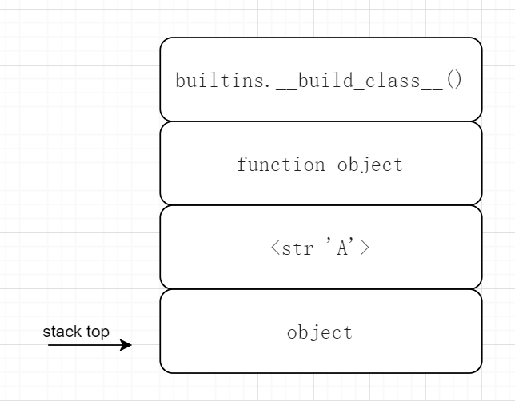
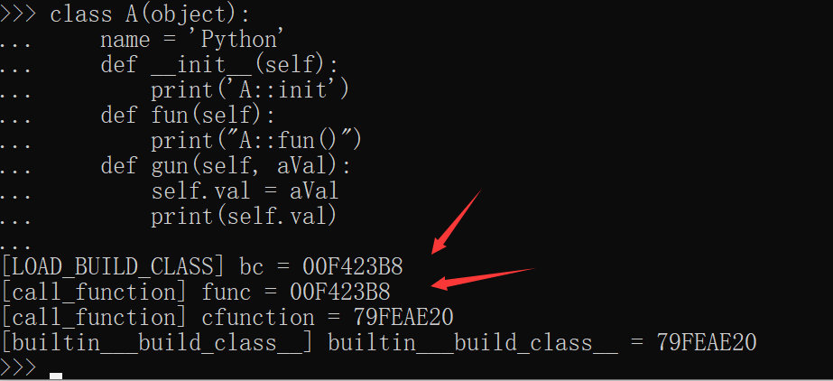

### 自定义class

> 鉴于本人能力及真的搞不太懂类定义(build_class)这一套，所以并没有深入细节，正如前文的一贯风格。

#### 类的定义

给出下列简单类定义：

```python
class A(object):
    name = 'Python'
    def __init__(self):
        print('A::init')
        
    def fun(self):
        print("A::fun()")
        
    def gun(self, aVal):
        self.val = aVal
        print(self.val)
```

用 dis 工具得到字节码如下：

```shell
  1           0 LOAD_BUILD_CLASS
              2 LOAD_CONST               0 (<code object A at 0x033202C8, file "test/class_test2.py", line 1>)
              4 LOAD_CONST               1 ('A')
              6 MAKE_FUNCTION            0
              8 LOAD_CONST               1 ('A')
             10 LOAD_NAME                0 (object)
             12 CALL_FUNCTION            3
             14 STORE_NAME               1 (A)


Disassembly of <code object A at 0x033202C8, file "test/class_test2.py", line 1>:
  1           0 LOAD_NAME                0 (__name__)
              2 STORE_NAME               1 (__module__)
              4 LOAD_CONST               0 ('A')
              6 STORE_NAME               2 (__qualname__)

  2           8 LOAD_CONST               1 ('Python')
             10 STORE_NAME               3 (name)

  3          12 LOAD_CONST               2 (<code object __init__ at 0x03320728, file "test/class_test2.py", line 3>)
             14 LOAD_CONST               3 ('A.__init__')
             16 MAKE_FUNCTION            0
             18 STORE_NAME               4 (__init__)

  6          20 LOAD_CONST               4 (<code object fun at 0x03320258, file "test/class_test2.py", line 6>)
             22 LOAD_CONST               5 ('A.fun')
             24 MAKE_FUNCTION            0
             26 STORE_NAME               5 (fun)

  9          28 LOAD_CONST               6 (<code object gun at 0x03320B88, file "test/class_test2.py", line 9>)
             30 LOAD_CONST               7 ('A.gun')
             32 MAKE_FUNCTION            0
             34 STORE_NAME               6 (gun)
             36 LOAD_CONST               8 (None)
             38 RETURN_VALUE

Disassembly of <code object __init__ at 0x03320728, file "test/class_test2.py", line 3>:
  4           0 LOAD_GLOBAL              0 (print)
              2 LOAD_CONST               1 ('A::init')
              4 CALL_FUNCTION            1
              6 POP_TOP
              8 LOAD_CONST               0 (None)
             10 RETURN_VALUE

Disassembly of <code object fun at 0x03320258, file "test/class_test2.py", line 6>:
  7           0 LOAD_GLOBAL              0 (print)
              2 LOAD_CONST               1 ('A::fun()')
              4 CALL_FUNCTION            1
              6 POP_TOP
              8 LOAD_CONST               0 (None)
             10 RETURN_VALUE

Disassembly of <code object gun at 0x03320B88, file "test/class_test2.py", line 9>:
 10           0 LOAD_FAST                1 (aVal)
              2 LOAD_FAST                0 (self)
              4 STORE_ATTR               0 (val)

 11           6 LOAD_GLOBAL              1 (print)
              8 LOAD_FAST                0 (self)
             10 LOAD_ATTR                0 (val)
             12 CALL_FUNCTION            1
             14 POP_TOP
             16 LOAD_CONST               0 (None)
             18 RETURN_VALUE
```

首先看位于前排的字节码：

```shell
  1           0 LOAD_BUILD_CLASS
              2 LOAD_CONST               0 (<code object A at 0x033202C8, file "test/class_test2.py", line 1>)
              4 LOAD_CONST               1 ('A')
              6 MAKE_FUNCTION            0
              8 LOAD_CONST               1 ('A')
             10 LOAD_NAME                0 (object)
             12 CALL_FUNCTION            3
             14 STORE_NAME               1 (A)
```

LOAD_BUILD_CLASS，再陌生不过的字节码，可以看[这里]( https://docs.python.org/3.7/library/dis.html?highlight=load_build_class#opcode-LOAD_BUILD_CLASS )：

>```
>LOAD_BUILD_CLASS
>```
>
>Pushes `builtins.__build_class__()` onto the stack. It is later called by [`CALL_FUNCTION`](https://docs.python.org/3.7/library/dis.html?highlight=load_build_class#opcode-CALL_FUNCTION) to construct a class.

接下来的三句字节码创建了一个函数对象并压入栈中，其中函数对象的 code object 是类 A 的定义：

```shell
              2 LOAD_CONST               0 (<code object A at 0x033202C8, file "test/class_test2.py", line 1>)
              4 LOAD_CONST               1 ('A')
              6 MAKE_FUNCTION            0
```

接着是将字符串 'A' 和 object 压栈，接着执行：

```shell
             12 CALL_FUNCTION            3
```

在执行 CALL_FUNCTION 字节码之前，栈内存示意图如下：



这里的 CALL_FUNCTION 的 oparg 是 3，很明显 CALL_FUNCTION 调用的函数是所谓的 `builtins.__build_class__()`。为了证实这一点，我们分别在 LOAD_BUILD_CLASS 和 call_function 处添加了打印信息：

```c
TARGET(LOAD_BUILD_CLASS) {
    _Py_IDENTIFIER(__build_class__);

    PyObject *bc;
    ...
    PUSH(bc);
    printf("[LOAD_BUILD_CLASS] bc = %p\n", bc);
    ...
}
```


```c
y_LOCAL_INLINE(PyObject *) _Py_HOT_FUNCTION
call_function(PyObject ***pp_stack, Py_ssize_t oparg, PyObject *kwnames)
{
    /*
     * 栈是向高处（可查看BASIC_PUSH 定义）增长的 (在压栈时 先压入 func，后压入参数)
     * 这里 oparg 是 位置参数 和 键参数 个数之和
    */
    PyObject **pfunc = (*pp_stack) - oparg - 1;
    PyObject *func = *pfunc;
    printf("[call_function] func = %p \n", func);
    ...
}
```

下列为对应的输出，可以看到 call_function 中的 func 正是在 LOAD_BUILD_CLASS 压入的 bc。



前面我们说到，call_function 会在三种不同的情况下被调用：

```c
	//call_function 内部的三个分支
	if (PyCFunction_Check(func)) {
        ...
    }
    else if (Py_TYPE(func) == &PyMethodDescr_Type) {
        ...
    }
    else {
        ...
    }
```

在 LOAD_BUILD_CLASS 走的其实是第一个分支，因为 func 包装的内层其实是一个 CFunction。也就是这里：

```c
	if (PyCFunction_Check(func)) {
        PyThreadState *tstate = PyThreadState_GET();
        C_TRACE(x, _PyCFunction_FastCallKeywords(func, stack, nargs, kwnames));
    }
```

进入 _PyCFunction_FastCallKeywords 内部你会发现 func 其实是一个 PyCFunctionObject：

```c
typedef struct {
    PyObject_HEAD
    PyMethodDef *m_ml; /* Description of the C function to call */
    PyObject    *m_self; /* Passed as 'self' arg to the C func, can be NULL */
    PyObject    *m_module; /* The __module__ attribute, can be anything */
    PyObject    *m_weakreflist; /* List of weak references */
} PyCFunctionObject;
```

真实的 CFunction 被包在 `PyMethodDef *m_ml` 这个域中：

```c
struct PyMethodDef {
    const char  *ml_name;   /* The name of the built-in function/method */
    PyCFunction ml_meth;    /* The C function that implements it */
    int         ml_flags;   /* Combination of METH_xxx flags, which mostly
                               describe the args expected by the C func */
    const char  *ml_doc;    /* The __doc__ attribute, or NULL */
};
typedef struct PyMethodDef PyMethodDef;
```

所以我们通过如下语句打印该函数指针的值：

```c
printf("[call_function] cfunction = %p\n", ((PyCFunctionObject*)func)->m_ml->ml_meth);
```

```c
//bltinmodule.c
static PyMethodDef builtin_methods[] = {
    {"__build_class__", (PyCFunction)builtin___build_class__,
     ...
    }
}
```

```c
/* AC: cannot convert yet, waiting for *args support */
static PyObject *
builtin___build_class__(PyObject *self, PyObject *const *args, Py_ssize_t nargs,
                        PyObject *kwnames)
{
    printf("[builtin___build_class__] builtin___build_class__ = %p\n", builtin___build_class__);
    ...
}
```

你会发现其实这个 CFunction 就是 `builtin___build_class__` ：


这样一来自定义 class 前排的字节码就初步了解了逻辑。注意到在 `builtin___build_class__` 中：

```c
cell = PyEval_EvalCodeEx(PyFunction_GET_CODE(func), PyFunction_GET_GLOBALS(func), ns,
                             NULL, 0, NULL, 0, NULL, 0, NULL,
                             PyFunction_GET_CLOSURE(func));
```

这里的 func 实际上是执行 MAKE_FUNCTION 放在栈中的函数对象，我们说过它的 code object 对应的即是自定义 class 的 code object。也就是：

```shell
Disassembly of <code object A at 0x033202C8, file "test/class_test2.py", line 1>:
  1           0 LOAD_NAME                0 (__name__)
              2 STORE_NAME               1 (__module__)
              4 LOAD_CONST               0 ('A')
              6 STORE_NAME               2 (__qualname__)

  2           8 LOAD_CONST               1 ('Python')
             10 STORE_NAME               3 (name)

  3          12 LOAD_CONST               2 (<code object __init__ at 0x03320728, file "test/class_test2.py", line 3>)
             14 LOAD_CONST               3 ('A.__init__')
             16 MAKE_FUNCTION            0
             18 STORE_NAME               4 (__init__)

  6          20 LOAD_CONST               4 (<code object fun at 0x03320258, file "test/class_test2.py", line 6>)
             22 LOAD_CONST               5 ('A.fun')
             24 MAKE_FUNCTION            0
             26 STORE_NAME               5 (fun)

  9          28 LOAD_CONST               6 (<code object gun at 0x03320B88, file "test/class_test2.py", line 9>)
             30 LOAD_CONST               7 ('A.gun')
             32 MAKE_FUNCTION            0
             34 STORE_NAME               6 (gun)
             36 LOAD_CONST               8 (None)
             38 RETURN_VALUE
```

前四句字节码把 `__name__`对应的值绑定到了 `__module__` ，将 'A' 绑定到了 `__qualname__`。接着就是实际的 python 代码逻辑，包括一个赋值语句和三个函数定义（把 code object 和函数名绑定起来）。

类 A 中比较有趣的函数定义当属 gun()：

```python
    def gun(self, aVal):
        self.val = aVal
        print(self.val)
```


```shell
Disassembly of <code object gun at 0x03320B88, file "test/class_test2.py", line 9>:
 10           0 LOAD_FAST                1 (aVal)
              2 LOAD_FAST                0 (self)
              4 STORE_ATTR               0 (val)

 11           6 LOAD_GLOBAL              1 (print)
              8 LOAD_FAST                0 (self)
             10 LOAD_ATTR                0 (val)
             12 CALL_FUNCTION            1
             14 POP_TOP
             16 LOAD_CONST               0 (None)
             18 RETURN_VALUE
```

从字节码 LOAD_FAST 可以看出，实参和对象指针 self 都是放在当前的 f_localsplus 中的。没看过的字节码就是 STORE_ATTR 和 LOAD_ATTR。比如 LOAD_ATTR：

```c
TARGET(LOAD_ATTR) {
    PyObject *name = GETITEM(names, oparg);
    PyObject *owner = TOP();
    PyObject *res = PyObject_GetAttr(owner, name);
    Py_DECREF(owner);
    SET_TOP(res);
    if (res == NULL)
        goto error;
    DISPATCH();
}
```

这里的 owner 其实就是栈顶的 self 啦。

在  `builtin___build_class__` 中，我们把得到的 class 对象返回，最终压入栈内，STORE_NAME 字节码则完成了在名字空间中类定义的绑定。

#### 类的实例化

```python
a = A()
```

函数调用产生的字节码如下：

```shell
 13          16 LOAD_NAME                1 (A)
             18 CALL_FUNCTION            0
             20 STORE_NAME               2 (a)
```

当调用类 A 的构造函数时，虚拟机把 A 压入了栈内，并执行了一个 CALL_FUNCTION 。对的，因为类 A 事实上是一个 callable 对象。经过多次调用后，最终会来到：

```c
PyObject *
_PyObject_FastCallKeywords(PyObject *callable, PyObject *const *stack, Py_ssize_t nargs,
                           PyObject *kwnames)
{
    ...
    else {
        /* Slow-path: build a temporary tuple for positional arguments and a
           temporary dictionary for keyword arguments (if any) */
        ...
        call = callable->ob_type->tp_call;
        if (call == NULL) {
            PyErr_Format(PyExc_TypeError, "'%.200s' object is not callable",
                         callable->ob_type->tp_name);
            return NULL;
        }

        ...
    }
}
```

最终执行调用的本体就是 tp_call 本 call。执行类定义后在命令行下：

```shell
>>> a.__call__
Traceback (most recent call last):
  File "<stdin>", line 1, in <module>
AttributeError: 'A' object has no attribute '__call__'
>>> A.__call__
<method-wrapper '__call__' of type object at 0x0162D418>
>>> a1=A.__call__()
A::init
>>> a1
<__main__.A object at 0x01B72770>
>>> a
<__main__.A object at 0x01B72460>
```

可以看到 tp_call 其实就是 `A.__call__` 也就是构造函数。

#### object_new 和 type_new

我们说过，类型定义也是一个对象，也就是我们所说的 class 对象，比如 PyList_Type，另一种也就是 instance 对象。object_new 和 type_new 分别对应 class 对象和 instance 对象的创建。这可以在不同 object 的 tp_new 中看出端倪：

```c
PyTypeObject PyType_Type = {
    PyVarObject_HEAD_INIT(&PyType_Type, 0)
    "type",                                     /* tp_name */
    ...
    offsetof(PyTypeObject, tp_dict),            /* tp_dictoffset */
    type_init,                                  /* tp_init */
    0,                                          /* tp_alloc */
    type_new,                                   /* tp_new */
    ...
};
```

```c
PyTypeObject PyBaseObject_Type = {
    PyVarObject_HEAD_INIT(&PyType_Type, 0)
    "object",                                   /* tp_name */
    sizeof(PyObject),                           /* tp_basicsize */
    0,                                          /* tp_itemsize */
  	...
    0,                                          /* tp_dictoffset */
    object_init,                                /* tp_init */
    PyType_GenericAlloc,                        /* tp_alloc */
    object_new,                                 /* tp_new */
    PyObject_Del,                               /* tp_free */
};
```

PyType_Type 的 tp_new 为 type_new，PyBaseObject_Type 的 tp_new 为 object_new。

我们在 type_call 中添加打印信息：

```c
static PyObject *
type_call(PyTypeObject *type, PyObject *args, PyObject *kwds)
{
    PyObject *obj;

    if (type->tp_new == NULL) {
        PyErr_Format(PyExc_TypeError,
                     "cannot create '%.100s' instances",
                     type->tp_name);
        return NULL;
    }
    if(type)
    {
        printf("%s \n", type->tp_name);
    }
    printf("tp_new=%p, type_new=%p, object_new=%p \n", type->tp_new, type_new, object_new);
    ...
}
```

当进行 class 的定义时，可以看到 type->tp_new 正是指向 type_new（此时的 type 就是 PyType_Type）。

```shell
>>> class A(object):
...     name = 'Python'
...     print('here')
...     def __init__(self):
...         print('A::init')
...     def fun(self):
...         print("A::fun()")
...     def gun(self, aVal):
...         self.val = aVal
...         print(self.val)
...

type
tp_new=7B0A47E0, type_new=7B0A47E0, object_new=7B0A4510
super
tp_new=7B0812D5, type_new=7B0A47E0, object_new=7B0A4510
```

当进行 A 类的实例化时，type 指向 A，type->tp_new 指向 object_new：

```SHELL
>>> a=A()
A
tp_new=7B0A4510, type_new=7B0A47E0, object_new=7B0A4510
A::init
```

其中 object_new 调用了 tp_alloc

```c
	return type->tp_alloc(type, 0);
```

默认也就是 PyType_GenericAlloc ：

```c
PyObject *
PyType_GenericAlloc(PyTypeObject *type, Py_ssize_t nitems)
{
    PyObject *obj;
    const size_t size = _PyObject_VAR_SIZE(type, nitems+1);
    /* note that we need to add one, for the sentinel */

    if (PyType_IS_GC(type))
        obj = _PyObject_GC_Malloc(size);
    else
        obj = (PyObject *)PyObject_MALLOC(size);

    if (obj == NULL)
        return PyErr_NoMemory();
	// 0 初始化
    memset(obj, '\0', size);

    if (type->tp_flags & Py_TPFLAGS_HEAPTYPE)
        Py_INCREF(type);

    if (type->tp_itemsize == 0)
        (void)PyObject_INIT(obj, type);
    else
        (void) PyObject_INIT_VAR((PyVarObject *)obj, type, nitems);

    if (PyType_IS_GC(type))
        _PyObject_GC_TRACK(obj);
    return obj;
}
```

#### 方法调用

对定义类进行方法调用，对应代码和字节码如下：

```python
A.fun()
a.gun()
```

```SHELL
 14          22 LOAD_NAME                1 (A)
             24 LOAD_METHOD              3 (fun)
             26 CALL_METHOD              0
             28 POP_TOP

 15          30 LOAD_NAME                2 (a)
             32 LOAD_METHOD              4 (gun)
             34 LOAD_CONST               2 (10)
             36 CALL_METHOD              1
             38 POP_TOP
```

涉及类的方法调用的字节码为 LOAD_METHOD 和 CALL_METHOD，两者配合针对 bound 和 unbound method 做了不同的处理：

>  https://docs.python.org/3.7/howto/descriptor.html#functions-and-methods 
>
> unbound 和 bound 的区别就是一个通过 class 去 access，一个通过 object

LOAD_METHOD 在 调用 _PyObject_GetMethod 其实有两个返回值，一个是 method_found，另一个是 meth （以参数的形式），当未找到对应的 method 时进行错误处理。而 method_found 作为返回值则是判断这个 method 是 bound 的还是 unbound 的。

LOAD_METHOD 当是 unbound 的时候用一个 NULL 去占位，后面 CALL_METHOD 就知道是 unbound 还是 bound method。具体的逻辑在注释里比较详细，在此不多赘述。

```c
TARGET(LOAD_METHOD) {
    /* Designed to work in tamdem with CALL_METHOD. */
    PyObject *name = GETITEM(names, oparg);
    PyObject *obj = TOP();
    PyObject *meth = NULL;

    int meth_found = _PyObject_GetMethod(obj, name, &meth);

    if (meth == NULL) {
        /* Most likely attribute wasn't found. */
        goto error;
    }

    if (meth_found) {
        /* We can bypass temporary bound method object.
                   meth is unbound method and obj is self.

                   meth | self | arg1 | ... | argN
                 */
        SET_TOP(meth);
        PUSH(obj);  // self
    }
    else {
        /* meth is not an unbound method (but a regular attr, or
                   something was returned by a descriptor protocol).  Set
                   the second element of the stack to NULL, to signal
                   CALL_METHOD that it's not a method call.

                   NULL | meth | arg1 | ... | argN
                */
        SET_TOP(NULL);
        Py_DECREF(obj);
        PUSH(meth);
    }
    DISPATCH();
}

TARGET(CALL_METHOD) {
    /* Designed to work in tamdem with LOAD_METHOD. */
    PyObject **sp, *res, *meth;

    sp = stack_pointer;

    meth = PEEK(oparg + 2);
    if (meth == NULL) {
        /* `meth` is NULL when LOAD_METHOD thinks that it's not
                   a method call.

                   Stack layout:

                       ... | NULL | callable | arg1 | ... | argN
                                                            ^- TOP()
                                               ^- (-oparg)
                                    ^- (-oparg-1)
                             ^- (-oparg-2)

                   `callable` will be POPed by call_function.
                   NULL will will be POPed manually later.
                */
        res = call_function(&sp, oparg, NULL);
        stack_pointer = sp;
        (void)POP(); /* POP the NULL. */
    }
    else {
        /* This is a method call.  Stack layout:

                     ... | method | self | arg1 | ... | argN
                                                        ^- TOP()
                                           ^- (-oparg)
                                    ^- (-oparg-1)
                           ^- (-oparg-2)

                  `self` and `method` will be POPed by call_function.
                  We'll be passing `oparg + 1` to call_function, to
                  make it accept the `self` as a first argument.
                */
        res = call_function(&sp, oparg + 1, NULL);
        stack_pointer = sp;
    }

    PUSH(res);
    if (res == NULL)
        goto error;
    DISPATCH();
}
```

这样一看，method 和 function 其实相差不大，背后的实现机制甚至可以说是一样的，只是 method 一般会有一个对应的 instance 对象（ self 参数），所谓的 class 其实就是数据 + function 啦。