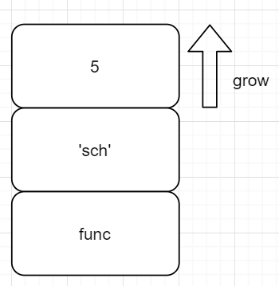

## 函数的参数

#### 参数的类型

Python 中函数的非可变长参数分为 positional argument 和 keyword argument，这两种参数的区别存在于调用时（实参）而不是形参：

```python
def fun(a, b):
    pass

fun(1, 2); # 全为位置参数
fun(1, b=2) # b为键参数
```

打印参数个数如下：

```shell
>>> fun(1, 2);
call_function: nkwargs=0, nargs=2
>>> fun(1, b=2)
call_function: nkwargs=1, nargs=1
```

查看 call_function 定义，可以发现，oparg 事实上就是位置参数和键参数的总和

```c
Py_LOCAL_INLINE(PyObject *) _Py_HOT_FUNCTION
call_function(PyObject ***pp_stack, Py_ssize_t oparg, PyObject *kwnames)
{
    /*
     * 栈是向高处（可查看BASIC_PUSH 定义）增长的 (在压栈时 先压入 func，后压入参数)
     * 这里 oparg 是 位置参数 和 键参数 个数之和
    */
    PyObject **pfunc = (*pp_stack) - oparg - 1;
    PyObject *func = *pfunc;
    PyObject *x, *w;
    Py_ssize_t nkwargs = (kwnames == NULL) ? 0 : PyTuple_GET_SIZE(kwnames);
    Py_ssize_t nargs = oparg - nkwargs;
    PyObject **stack = (*pp_stack) - nargs - nkwargs;
	...
}
```

如前所述，call_function 会调用 _PyFunction_FastCallKeywords，其内有三个返回点，对应情况分别如下：

- argdefs == NULL && co->co_argcount == nargs，定义函数时没有默认参数，且用户显式给出了所有的参数
- nargs == 0 && argdefs != NULL && co->co_argcount == PyTuple_GET_SIZE(argdefs)，用户没有给参数，全部使用函数的默认（位置）参数
- 其他情况

```c
PyObject *
_PyFunction_FastCallKeywords(PyObject *func, PyObject *const *stack,
                             Py_ssize_t nargs, PyObject *kwnames)
{
    ...

    if (co->co_kwonlyargcount == 0 && nkwargs == 0 &&
        (co->co_flags & ~PyCF_MASK) == (CO_OPTIMIZED | CO_NEWLOCALS | CO_NOFREE))
    {
        /* 该函数有三个 返回点 */
        if (argdefs == NULL && co->co_argcount == nargs) {
            /*ADDED BY SCH001*/
            printf("branch 1\n");
            return function_code_fastcall(co, stack, nargs, globals);
        }
        else if (nargs == 0 && argdefs != NULL
                 && co->co_argcount == PyTuple_GET_SIZE(argdefs)) {
            /* function called with no arguments, but all parameters have
               a default value: use default values as arguments .*/
            printf("branch 2");
            stack = &PyTuple_GET_ITEM(argdefs, 0);
            return function_code_fastcall(co, stack, PyTuple_GET_SIZE(argdefs),
                                          globals);
        }
    }

    ...
    printf("branch 3 \n");
    return _PyEval_EvalCodeWithName((PyObject*)co, globals, (PyObject *)NULL,
                                    stack, nargs,
                                    /* 如果nkwargs 大于 0，那么这里会拿到一个指针数组(kwnames) tuple->array */
                                    nkwargs ? &PyTuple_GET_ITEM(kwnames, 0) : NULL,
                                    /* 与kwnames 对应的 kwargs */
                                    stack + nargs,
                                    nkwargs, 1,
                                    d, (int)nd, kwdefs,
                                    closure, name, qualname);
}
```

```shell
>>> fun(1, 2);
call_function: nkwargs=0, nargs=2
branch 1
>>> fun(1, b=2)
call_function: nkwargs=1, nargs=1
branch 3
```

#### _PyEval_EvalCodeWithName 参数的处理（简述）

```python
func(1, b=2)
```

上述 python 代码会产生如下字节码，注意这里由于出现了键参数，故而表示函数调用的字节码为 CALL_FUNCTION_KW 而不是 CALL_FUNCTION：

```shell
  5           8 LOAD_NAME                0 (fun)
             10 LOAD_CONST               2 (1)
             12 LOAD_CONST               3 (2)
             14 LOAD_CONST               4 (('b',))
             16 CALL_FUNCTION_KW         2
             18 POP_TOP
```

参数的值无论是位置参数还是键参数最终都会直接（裸）压入栈中，而键参数的 keys 则会做成一个 tuple 再入栈，这在 _PyEval_EvalCodeWithName 对参数的处理中也可以看出来。

当出现位置参数时，会进入 _PyEval_EvalCodeWithName 而不是我们之前所说的 function_code_fastcall。接着来看看形参和实参的对应关系：


kwnames 其实就是键参数的keys，从这里我们可以看到 kwnames 是一个 tuple：

```c
 assert(kwnames == NULL || PyTuple_CheckExact(kwnames));
```

你可能会觉得这行代码有些诡异：

```c
nkwargs ? &PyTuple_GET_ITEM(kwnames, 0) : NULL, /*对应调用函数的 kwnames*/
```

其实它就是把 kwnames 从 tuple 转成了（指针数组 PyObject* []）array，因为我们确信 tuple 的内存就是连续的，所以只要拿到**第一个元素的地址**就行了。

然后我们再到 _PyEval_EvalCodeWithName 中一探究竟，在其中大量使用了 SET_LOCAL 和 GET_LOCAL 宏，定就是方便 fastlocals 的读取：

```c
#define GETLOCAL(i)     (fastlocals[i])

/* The SETLOCAL() macro must not DECREF the local variable in-place and
   then store the new value; it must copy the old value to a temporary
   value, then store the new value, and then DECREF the temporary value.
   This is because it is possible that during the DECREF the frame is
   accessed by other code (e.g. a __del__ method or gc.collect()) and the
   variable would be pointing to already-freed memory. */
#define SETLOCAL(i, value)      do { PyObject *tmp = GETLOCAL(i); \
                                     GETLOCAL(i) = value; \
                                     Py_XDECREF(tmp); } while (0)
```

by the way：

```c
fastlocals = f->f_localsplus;
```

处理位置参数：

```c
/* Copy positional arguments into local variables */
if (argcount > co->co_argcount) {
    n = co->co_argcount;
}
else {
    n = argcount;
}
for (i = 0; i < n; i++) {
    x = args[i];
    Py_INCREF(x);
    SETLOCAL(i, x);
}

/* Pack other positional arguments into the *args argument */
if (co->co_flags & CO_VARARGS) {
    u = PyTuple_New(argcount - n);
    if (u == NULL) {
        goto fail;
    }
    SETLOCAL(total_args, u);
    for (i = n; i < argcount; i++) {
        x = args[i];
        Py_INCREF(x);
        PyTuple_SET_ITEM(u, i-n, x);
    }
}
```

键参数也被放入了 f_localsplus中：

```c
/* Handle keyword arguments passed as two strided arrays 
  key 参数会在这里 进入 LOCAL空间
*/
kwcount *= kwstep;
for (i = 0; i < kwcount; i += kwstep) {
    PyObject **co_varnames;
    PyObject *keyword = kwnames[i];
    PyObject *value = kwargs[i];
    ...
}
```

处理默认参数：

```c
/* 默认参数有两种 位置和键默认参数 */
/* Add missing positional arguments (copy default values from defs) */
if (argcount < co->co_argcount) {
    Py_ssize_t m = co->co_argcount - defcount;
    Py_ssize_t missing = 0;
    for (i = argcount; i < m; i++) {
        if (GETLOCAL(i) == NULL) {
            missing++;
        }
    }
    if (missing) {
        missing_arguments(co, missing, defcount, fastlocals);
        goto fail;
    }
    if (n > m)
        i = n - m;
    else
        i = 0;
    for (; i < defcount; i++) {
        if (GETLOCAL(m+i) == NULL) {
            PyObject *def = defs[i];
            Py_INCREF(def);
            SETLOCAL(m+i, def);
        }
    }
}

/* Add missing keyword arguments (copy default values from kwdefs) */
if (co->co_kwonlyargcount > 0) {
    Py_ssize_t missing = 0;
    for (i = co->co_argcount; i < total_args; i++) {
        PyObject *name;
        if (GETLOCAL(i) != NULL)
            continue;
        name = PyTuple_GET_ITEM(co->co_varnames, i);
        if (kwdefs != NULL) {
            PyObject *def = PyDict_GetItem(kwdefs, name);
            if (def) {
                Py_INCREF(def);
                SETLOCAL(i, def);
                continue;
            }
        }
        missing++;
    }
    if (missing) {
        missing_arguments(co, missing, -1, fastlocals);
        goto fail;
    }
}
```

#### 其他参数

##### 拓展（可变长）参数

观察如下代码及输出：

```shell
>>> def fun(a, b):
...     pass
...
>>> def fun3(a, b, *lis):
...     pass
...
>>> # fun(1, 2)
... fun(1, b=2)
[_PyFunction_FastCallKeywords]: co_argcount=2, co_nlocals=2
>>>
>>> fun3(1,2,3,4)
[_PyFunction_FastCallKeywords]: co_argcount=2, co_nlocals=3
```

对于 fun(1, b=2)，co_argcount=2, co_nlocals=2 是比较合理的，而对于 fun3(1,2,3,4) 而言，我们看到 co_argcount=2，也就是 lis 这个可变长参数其实直接被当成了一个 local 变量。

##### 局部变量

```python
>>> def fun(a, b):
...     c=1
```

可以看到加入局部变量后的函数调用的输出也是十分合理的：

```shell
>>> fun2(1 ,2)
[_PyFunction_FastCallKeywords]: co_argcount=2, co_nlocals=3
```

#### 参数的传递

##### 参数所处的位置

在本小节中我们来探索位置参数的额传递和访问，有如下 python 代码

```python
def fun(name, age):
    age += 5
    print('[', name, ', ', age, ']')

fun('sch', 5)
```

fun('sch', 5) 函数调用语句对应字节码如下

```shell
  5           8 LOAD_NAME                0 (fun)
             10 LOAD_CONST               2 ('sch')
             12 LOAD_CONST               3 (5)
             14 CALL_FUNCTION            2
             16 POP_TOP
             18 LOAD_CONST               4 (None)
             20 RETURN_VALUE
```

此时运行时栈如下所示



在 call_function 中

```c
Py_LOCAL_INLINE(PyObject *) _Py_HOT_FUNCTION
call_function(PyObject ***pp_stack, Py_ssize_t oparg, PyObject *kwnames)
{
    /*
     * 栈是向高处（可查看BASIC_PUSH 定义）增长的 (在压栈时 先压入 func，后压入参数)
     * 这里 oparg 是 位置参数 和 键参数 个数之和
    */
    PyObject **pfunc = (*pp_stack) - oparg - 1;
    PyObject *func = *pfunc;
    PyObject *x, *w;
    Py_ssize_t nkwargs = (kwnames == NULL) ? 0 : PyTuple_GET_SIZE(kwnames);
    Py_ssize_t nargs = oparg - nkwargs;
    PyObject **stack = (*pp_stack) - nargs - nkwargs;
    ...
}
```

如前所述，这里的 oparg 为函数传递的参数个数（包括位置参数和键参数，oparg = nargs + nkwargs），所以 pfunc 指向的位置就是指向函数对象 func 的栈地址，stack 则指向存放参数的栈地址起始处。

在传递参数时如果出现键参数形式时，所有的 key 会被打包成一个 tuple，这也是为什么 位置参数的个数可以由以下公式获得：

```c
Py_ssize_t nkwargs = (kwnames == NULL) ? 0 : PyTuple_GET_SIZE(kwnames);
```

同时注意到，这个tuple是最后压栈的，这意味着这个 tuple 将出现于栈顶：


所以在调用 call_function 之前，会先执行一次 POP，将栈顶的 tuple 拿出来。

```c
TARGET(CALL_FUNCTION_KW) {
    PyObject **sp, *res, *names;

    names = POP();
    assert(PyTuple_CheckExact(names) && PyTuple_GET_SIZE(names) <= oparg);
    sp = stack_pointer;
    res = call_function(&sp, oparg, names);
    ...
}
```

所以无论是否使用了键参数形式，这里的 pfunc 和 stack 的计算都不会受其影响。

##### 一个栈帧中的 f_localplus

注意到当只使用位置参数时，被调用的 function_code_fastcall 最终会把参数都塞入当前栈帧 f 的 f_localplus 中（参数形式包含键参数时，参数也会被塞进其中，处理逻辑相对会复杂一些，见前述）：

```c
fastlocals = f->f_localsplus;

for (i = 0; i < nargs; i++) {
    Py_INCREF(*args);
    fastlocals[i] = *args++;
}
result = PyEval_EvalFrameEx(f,0);
```

f_localplus 在 FrameObject 中的主要职责是维护局部变量和运行时栈动态内存：

```c
PyObject *f_localsplus[1];  /* locals+stack, dynamically sized */
```

在 _PyFrame_New_NoTrack 新建一个栈帧时：

```c
	f->f_code = code;
    extras = code->co_nlocals + ncells + nfrees;
    f->f_valuestack = f->f_localsplus + extras;
    for (i=0; i<extras; i++)
        f->f_localsplus[i] = NULL;
    f->f_locals = NULL;
    f->f_trace = NULL;
```

虽然一个栈桢中存放局部变量的地方和运行时栈看似逻辑关系不大，但他们在物理上实则是紧密相连的。


回到之前我们定义的函数例子：

```python
def fun(name, age):
    age += 5
    print('[', name, ', ', age, ']')
```

以下为其对应 code object 的字节码：

```shell
Disassembly of <code object fun at 0x03505488, file "test/pass_arg.py", line 1>:
  2           0 LOAD_FAST                1 (age)
              2 LOAD_CONST               1 (5)
              4 INPLACE_ADD
              6 STORE_FAST               1 (age)

  3           8 LOAD_GLOBAL              0 (print)
             10 LOAD_CONST               2 ('[')
             12 LOAD_FAST                0 (name)
             14 LOAD_CONST               3 (', ')
             16 LOAD_FAST                1 (age)
             18 LOAD_CONST               4 (']')
             20 CALL_FUNCTION            5
             22 POP_TOP
             24 LOAD_CONST               0 (None)
             26 RETURN_VALUE
```

这里的 LOCAL_FAST 和 STORE_FAST 其实就是访问我们前述 f_localsplus 中的 locals 空间：

```c
TARGET(LOAD_FAST) {
    /* 访问 f_localplus 空间，也就是存放局部变量的地方 */
    PyObject *value = GETLOCAL(oparg);
    if (value == NULL) {
        format_exc_check_arg(PyExc_UnboundLocalError,
                             UNBOUNDLOCAL_ERROR_MSG,
                             PyTuple_GetItem(co->co_varnames, oparg));
        goto error;
    }
    Py_INCREF(value);
    PUSH(value);
    FAST_DISPATCH();
}
```

#### 默认参数

python 代码如下：

```python
def fun(a=1, b=2):
    print(a+b)
```

字节码如下：

```shell
  1           0 LOAD_CONST               5 ((1, 2))
              2 LOAD_CONST               2 (<code object fun at 0x03675488, file "test/def_arg.py", line 1>)
              4 LOAD_CONST               3 ('fun')
              6 MAKE_FUNCTION            1
              8 STORE_NAME               0 (fun)
             10 LOAD_CONST               4 (None)
             12 RETURN_VALUE
```

这里的默认参数被打包成一个 tuple，被压入栈中，随后执行字节码 MAKE_FUNCTION。

```c
TARGET(MAKE_FUNCTION) {
    PyObject *qualname = POP();
    PyObject *codeobj = POP();
    PyFunctionObject *func = (PyFunctionObject *)
    PyFunction_NewWithQualName(codeobj, f->f_globals, qualname);

    ...
    if (oparg & 0x01) {
    	assert(PyTuple_CheckExact(TOP()));
        func->func_defaults = POP();
    }

    PUSH((PyObject *)func);
    DISPATCH();
}
```

这也正说明，事实上（位置参数的）默认参数信息是在执行 MAKE_FUNTION (也可以理解成 def )动作

时被放在 function object 中，而不是放在静态的 code object 中。

当执行 fun() 调用时，会进入我们之前说的三个返回点的第二个：

```c
if (co->co_kwonlyargcount == 0 && nkwargs == 0 &&
        (co->co_flags & ~PyCF_MASK) == (CO_OPTIMIZED | CO_NEWLOCALS | CO_NOFREE))
{
    /* 该函数有三个 返回点 */
    if (argdefs == NULL && co->co_argcount == nargs) {
        /*ADDED BY SCH001*/
        printf("branch 1\n");
        return function_code_fastcall(co, stack, nargs, globals);
    }
    else if (nargs == 0 && argdefs != NULL
             && co->co_argcount == PyTuple_GET_SIZE(argdefs)) {
        /* function called with no arguments, but all parameters have
               a default value: use default values as arguments .
               把 tuple 的内存假装是 运行时栈......
               */
        printf("branch 2");
        stack = &PyTuple_GET_ITEM(argdefs, 0);
        return function_code_fastcall(co, stack, PyTuple_GET_SIZE(argdefs),
                                      globals);
    }
}
```

看到这一句：

```c
stack = &PyTuple_GET_ITEM(argdefs, 0);
```

你会发现其实这里用默认参数打包成的 tuple 假装是运行时栈...

当给了一个参数值后，也就是函数调用 fun(1) 后

```shell
>>> fun(1)
>>> branch 3
```

因为参数的值分布在默认参数打包的 tuple 和 真正的运行时栈 两个地方，所以只能执行更一般的 branch 3。

#### 拓展位置参数（TODO）

##### 拓展位置参数

##### 拓展键参数


#### 函数中的局部变量

前面提到，函数参数实际上是一种特殊的局部变量，给出以下 python 代码：

```python
def fun():
    loc = 1
    pass

fun()
```

在 function_code_fastcall 添加打印信息，我们发现新建的栈帧中 f_locals 命名空间为 NULL：

```c
static PyObject* _Py_HOT_FUNCTION
function_code_fastcall(PyCodeObject *co, PyObject *const *args, Py_ssize_t nargs,
                       PyObject *globals)
{
    ...
    f = _PyFrame_New_NoTrack(tstate, co, globals, NULL);
    if (f == NULL) {
        return NULL;
    }
	
    //打印信息
    printf("nargs=%d, f_locals=%p, f_localsplus=%p", nargs, f->f_locals, f->f_localsplus);
    ...
}
```

输出：

```shell
nargs=0, f_locals=00000000, f_localsplus=00F89D74
```

局部变量的信息应该是放在 f_localsplus 中，因为看到 函数对象 fun 对应的 code object 操作局部变量 loc 时使用了 STORE_FAST：

```shell
  2           0 LOAD_CONST               1 (1)
              2 STORE_FAST               0 (loc)
```

该字节码正是对 fastlocals 也正是 当前栈帧 f 的 f_localsplus 进行操作：

```c
fastlocals = f->f_localsplus;
```

