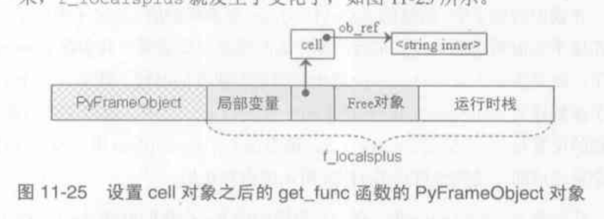
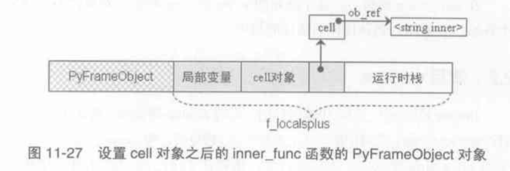

### 闭包——浪漫伊始

简单来说，闭包就是一个名字空间与一个函数绑定后的结晶。在 python 中，闭包经常与嵌套函数同框，来看下面的例子：

```python
# 代码[1]
def get_cmp(base):
    def cmp(value):
        return value > base
    return cmp

cmp = get_cmp(10)
print(cmp(5))
print(cmp(10))
# print(cmp(5, -1)) 报错
```

> 摘自《Python 源码剖析》
>
> 闭包是*最内嵌套作用域规则*的一种实现方式，规则是形而上的“道”，而闭包是形而下的”器“。

同样，为了实现如上的效果，我们完全可以经由另一种方式（默认参数）而不是闭包：

```python
# 代码[2]
def get_cmp(base):
    def cmp(value, base=base):
        return value > base
    return cmp

cmp = get_cmp(10)
print(cmp(5))
print(cmp(10))
print(cmp(5, -1)) # no problem
```

#### 实现闭包的基石

闭包的实现通常是利用嵌套函数来完成的。PyCodeObject 中，与嵌套函数相关的属性是 co_cellvars 和 co_freevars。

```c
PyObject *co_freevars;      /* tuple of strings (free variable names) */
PyObject *co_cellvars;      /* tuple of strings (cell variable names) */
```

- co_cellvars：由字符串组成的 tuple，保存**嵌套的作用域中**使用的变量名集合
- co_freevars：由字符串组成的 tuple，保存**使用了的外层作用域**的变量名集合

注意这里的 ncells 是被包括在 co_nlocals 中的，因为 cell 变量 一定是当前函数的一个局部变量。

```shell
>>> def get_cmp(base):
...     def cmp(value):
...         return value > base
...     return cmp
...
co_nlocals=0, ncells=0, nfrees=0
>>> cmp = get_cmp(10)
co_nlocals=0, ncells=0, nfrees=0
# base + cmp | base | NULL
co_nlocals=2, ncells=1, nfrees=0
>>> print("----")
co_nlocals=0, ncells=0, nfrees=0
----
>>> cmp(5)
co_nlocals=0, ncells=0, nfrees=0
# value | NULL | base
co_nlocals=1, ncells=0, nfrees=1
```

在 PyFrameObject 中，还有一个 f_localsplus 与闭包息息相关，这块内存由运行时栈、局部变量、cell对象和free对象组成：

```c
//_PyFrame_New_NoTrack
extras = code->co_nlocals + ncells + nfrees;//除了运行时栈之外的三块
```


#### 闭包的实现

内层嵌套函数可引用函数参数（代码[1]的 base）或者外层的局部变量（代码[3]的 val）：

```python
# 代码[3]
def get_func():
    val = "inner"
    def inner_func():
        print(val)
    return inner_func

show_val = get_func()
show_val()
```

编译得到字节码如下：

```shell
 14           0 LOAD_CONST               0 (<code object get_func at 0x02DD02C8, file "test/closure.py", line 14>)
              2 LOAD_CONST               1 ('get_func')
              4 MAKE_FUNCTION            0
              6 STORE_NAME               0 (get_func)

 20           8 LOAD_NAME                0 (get_func)
             10 CALL_FUNCTION            0
             12 STORE_NAME               1 (show_val)

 21          14 LOAD_NAME                1 (show_val)
             16 CALL_FUNCTION            0
             18 POP_TOP
             20 LOAD_CONST               2 (None)
             22 RETURN_VALUE

Disassembly of <code object get_func at 0x02DD02C8, file "test/closure.py", line 14>:
 15           0 LOAD_CONST               1 ('inner')
              2 STORE_DEREF              0 (val)

 16           4 LOAD_CLOSURE             0 (val)
              6 BUILD_TUPLE              1
              8 LOAD_CONST               2 (<code object inner_func at 0x02DD0258, file "test/closure.py", line 16>)
             10 LOAD_CONST               3 ('get_func.<locals>.inner_func')
             12 MAKE_FUNCTION            8
             14 STORE_FAST               0 (inner_func)

 18          16 LOAD_FAST                0 (inner_func)
             18 RETURN_VALUE

Disassembly of <code object inner_func at 0x02DD0258, file "test/closure.py", line 16>:
 17           0 LOAD_GLOBAL              0 (print)
              2 LOAD_DEREF               0 (val)
              4 CALL_FUNCTION            1
              6 POP_TOP
              8 LOAD_CONST               0 (None)
             10 RETURN_VALUE
```

##### 创建 closure

当执行 CALL_FUNCTION 指令调用 get_func 时，会进入 _PyEval_EvalCodeWithName 中，如下为处理 cell 变量的逻辑：

```c
    for (i = 0; i < PyTuple_GET_SIZE(co->co_cellvars); ++i) {
            PyObject *c;
            Py_ssize_t arg;
            /* Possibly account for the cell variable being an argument. */
            if (co->co_cell2arg != NULL &&
                (arg = co->co_cell2arg[i]) != CO_CELL_NOT_AN_ARG) {
                c = PyCell_New(GETLOCAL(arg));
                /* 内层嵌套函数引用的自由变量是 外层函数的 参数 */
                /* cell 最终就是在 f_localsplus里面直接拿的，
               因为前面已经放进去了（比如位置参数或者键参数）
               也就是说 nlocals包含了 ncell 这部分！*/
                /* Clear the local copy. */
                SETLOCAL(arg, NULL);
            }
            else {
                /* 内层嵌套函数引用的自由变量 是外层函数的 局部变量 */
                c = PyCell_New(NULL);
            }
            if (c == NULL)
                goto fail;
            SETLOCAL(co->co_nlocals + i, c);
        }
```

看看 PyCell_New 

```c
PyObject *
PyCell_New(PyObject *obj)
{
    PyCellObject *op;

    op = (PyCellObject *)PyObject_GC_New(PyCellObject, &PyCell_Type);
    if (op == NULL)
        return NULL;
    op->ob_ref = obj;
    Py_XINCREF(obj);

    _PyObject_GC_TRACK(op);
    return (PyObject *)op;
}
```

PyCellObject 只是套了个壳：

```c
typedef struct {
    PyObject_HEAD
    PyObject *ob_ref;       /* Content of the cell or NULL when empty */
} PyCellObject;
```

##### 外层函数

get_func 的code object 对应字节码如下：

```shell
Disassembly of <code object get_func at 0x02DD02C8, file "test/closure.py", line 14>:
 15           0 LOAD_CONST               1 ('inner')
              2 STORE_DEREF              0 (val)

 16           4 LOAD_CLOSURE             0 (val)
              6 BUILD_TUPLE              1
              8 LOAD_CONST               2 (<code object inner_func at 0x02DD0258, file "test/closure.py", line 16>)
             10 LOAD_CONST               3 ('get_func.<locals>.inner_func')
             12 MAKE_FUNCTION            8
             14 STORE_FAST               0 (inner_func)

 18          16 LOAD_FAST                0 (inner_func)
             18 RETURN_VALUE
```

将 'inner' 压栈后，STORE_DEREF 对应代码如下：

```c
TARGET(STORE_DEREF) {
    PyObject *v = POP();
    PyObject *cell = freevars[oparg];
    PyObject *oldobj = PyCell_GET(cell);
    PyCell_SET(cell, v);
    Py_XDECREF(oldobj);
    DISPATCH();
}
```

这里的 cell 是在 _PyEval_EvalCodeWithName 中创建的，这里把 'inner' POP 出来后放在了 cell 中。

随后 LOAD_CLOSURE 又把该 cell 放在了栈顶：

```c
TARGET(LOAD_CLOSURE) {
    PyObject *cell = freevars[oparg];
    Py_INCREF(cell);
    PUSH(cell);
    DISPATCH();
}
```

接着通过 BUILD_TUPLE 将这些 cell 做成了一个 tuple，接下来的两个 LOAD_CONST 和 MAKE_FUNCTION 很明显是执行 def 动作的常规操作，注意到 MAKE_FUNCTION 的这里：

```c
	...
	if (oparg & 0x08) {
        assert(PyTuple_CheckExact(TOP()));
        func ->func_closure = POP();
     }
	...
```

做成的 tuple 最终被放在了新建函数对象 func 的 func_closure。

接着 STORE_FAST 把函数对象放在了 get_func 栈帧中的 f_localsplus 中。该栈帧 f_localsplus 内存布局如下：



##### 内层函数

在 inner_func 对应的 code object 中，是通过 LOAD_DEREF 取得 cell 中对应的 值对象，内层函数栈帧 f_localsplus 内存布局如下：



#### Decorator

来随便看看 python 的 decorator 也就是所谓的装饰器：

```python
def should_say(fn):
    def say(*args):
        print("say sth...")
        fn(*args)
    return say

@should_say
def func():
    print('in func')

func()
```

你会发现其实这样也能达到 decorator 的效果：

```python
# -------------------------- # 
def func():
    print('in func')

func = should_say(func)
func()
```

观察字节码，你会发现两次 func 的 code object 都是一样的：

```shell
[1]
Disassembly of <code object func at 0x031EE5D8, file "test/closure.py", line 29>:
 31           0 LOAD_GLOBAL              0 (print)
              2 LOAD_CONST               1 ('in func')
              4 CALL_FUNCTION            1
              6 POP_TOP
              8 LOAD_CONST               0 (None)
             10 RETURN_VALUE
[2]
Disassembly of <code object func at 0x031EEB88, file "test/closure.py", line 36>:
 37           0 LOAD_GLOBAL              0 (print)
              2 LOAD_CONST               1 ('in func')
              4 CALL_FUNCTION            1
              6 POP_TOP
              8 LOAD_CONST               0 (None)
             10 RETURN_VALUE
```

相对来说 "自制的 decorator" 只是多执行了一次 LOAD_NAME 和 STORE_NAME 的动作：

```shell
 [1]
 29           8 LOAD_NAME                0 (should_say)
             10 LOAD_CONST               2 (<code object func at 0x031EE5D8, file "test/closure.py", line 29>)
             12 LOAD_CONST               3 ('func')
             14 MAKE_FUNCTION            0
             16 CALL_FUNCTION            1
             18 STORE_NAME               1 (func)

[2]
 36          20 LOAD_CONST               4 (<code object func at 0x031EEB88, file "test/closure.py", line 36>)
             22 LOAD_CONST               3 ('func')
             24 MAKE_FUNCTION            0
             26 STORE_NAME               1 (func)

 39          28 LOAD_NAME                0 (should_say)
             30 LOAD_NAME                1 (func)
             32 CALL_FUNCTION            1
             34 STORE_NAME               1 (func)
```

也就是说，装饰器也就只是可以减少字节码执行的一个语法糖。

#### 其他

PyFrameObject 中与闭包相关的 cellvars 和 freevars 其实被统一称为 freevars，从这里可以看出一点端倪：

```c
freevars = f->f_localsplus + co->co_nlocals;
```

