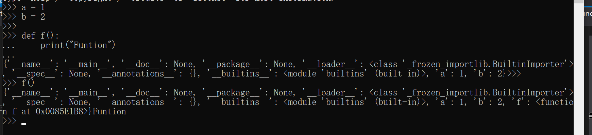

## Python虚拟机中的函数机制

### 前情

> 有两个对象与函数有关，`PyCodeObject`和`PyFunctionObject`，`PyCodeObject`是对一段源代码的静态表示，是编译时的结果；`PyFunctionObject`对象是Python代码在运行时动态产生的，是在执行一个def语句时创建的。

PyFunctionObject中会有对PyCodeObject的引用`func_code`。

```c
/* Function objects and code objects should not be confused with each other:
 Function objects are created by the execution of the 'def' statement. They reference a code object in their __code__ attribute, which is a purely syntactic object, i.e. nothing more than a compiled version of some source code lines.  There is one code object per source code "fragment", but each code object can be referenced by zero or many function objects depending only on how many times the 'def' statement in the source was executed so far.
 */

typedef struct {
    PyObject_HEAD
    PyObject *func_code;        /* A code object, the __code__ attribute */
    PyObject *func_globals;     /* A dictionary (other mappings won't do) */
    PyObject *func_defaults;    /* NULL or a tuple */
    PyObject *func_kwdefaults;  /* NULL or a dict */
    PyObject *func_closure;     /* NULL or a tuple of cell objects */
    ...
    /* Invariant:
    func_closure contains the bindings for func_code->co_freevars, so PyTuple_Size(func_closure) == PyCode_GetNumFree(func_code) (func_closure may be NULL if PyCode_GetNumFree(func_code) == 0).
     */
} PyFunctionObject;
```

### 无参函数调用

#### 函数定义

考察以下python代码：

```python
def f():
    print("Funtion")

f()
```

得到字节码如下：

```shell
  1           0 LOAD_CONST               0 (<code object f at 0x031D4488, file "test/function.py", line 1>)
              2 LOAD_CONST               1 ('f')
              4 MAKE_FUNCTION            0
              6 STORE_NAME               0 (f)

  4           8 LOAD_NAME                0 (f)
             10 CALL_FUNCTION            0
             12 POP_TOP
             14 LOAD_CONST               2 (None)
             16 RETURN_VALUE

Disassembly of <code object f at 0x031D4488, file "test/function.py", line 1>:
  2           0 LOAD_GLOBAL              0 (print)
              2 LOAD_CONST               1 ('Funtion')
              4 CALL_FUNCTION            1
              6 POP_TOP
              8 LOAD_CONST               0 (None)
             10 RETURN_VALUE
```

可以看到，**函数 f 的内部代码被编译成了一段以 code object 形式存在的字节码**，在执行def动作时，会通过两个 LOAD_CONST 将 code object 和 函数名 f 压栈，接下来的字节码为  MAKE_FUNCTION，取栈参数后新建一个 PyFunctionObject 对象并压入运行时栈，注意该函数对象的 globals 命名空间事实上是当前栈帧 f 的 f_globals（也就是说，.py 文件和函数的 global 命名空间是同一个），对应代码实现如下：

```c
TARGET(MAKE_FUNCTION) {
    PyObject *qualname = POP();
    PyObject *codeobj = POP();
    PyFunctionObject *func = (PyFunctionObject *)
        PyFunction_NewWithQualName(codeobj, f->f_globals, qualname);

    Py_DECREF(codeobj);
    Py_DECREF(qualname);
    ...
        PUSH((PyObject *)func);
    DISPATCH();
}
```

该 python 代码包括了两个 code object，整个 .py 文件和函数的内部代码，函数的声明（MAKE_FUNCTION）和实现（内部代码）在物理上是分开的，def 这个动作是直到运行时才执行。

#### 函数调用

接下来来考察下函数调用的机制，以下两句字节码执行了函数调用的动作：

```shell
 4           8 LOAD_NAME                0 (f)
             10 CALL_FUNCTION            0
```

由于我们是无参调用，只需要把对应的 PyFunctionObject 压栈并执行 CALL_FUNCTION 即可;

```c
TARGET(CALL_FUNCTION) {
    PyObject **sp, *res;
    sp = stack_pointer;
    res = call_function(&sp, oparg, NULL);
    stack_pointer = sp;
    PUSH(res);
    if (res == NULL) {
        goto error;
    }
    DISPATCH();
}
```

真正执行调用动作其实是 call_function，其会调用 _PyFunction_FastCallKeywords：

```c
PyObject *
_PyFunction_FastCallKeywords(PyObject *func, PyObject *const *stack,
                             Py_ssize_t nargs, PyObject *kwnames)
{
    PyCodeObject *co = (PyCodeObject *)PyFunction_GET_CODE(func);
    PyObject *globals = PyFunction_GET_GLOBALS(func);
    PyObject *argdefs = PyFunction_GET_DEFAULTS(func);
    PyObject *kwdefs, *closure, *name, *qualname;
    PyObject **d;
    Py_ssize_t nkwargs = (kwnames == NULL) ? 0 : PyTuple_GET_SIZE(kwnames);
    Py_ssize_t nd;

    assert(PyFunction_Check(func));
    assert(nargs >= 0);
    assert(kwnames == NULL || PyTuple_CheckExact(kwnames));
    assert((nargs == 0 && nkwargs == 0) || stack != NULL);
    /* kwnames must only contains str strings, no subclass, and all keys must
       be unique */

    if (co->co_kwonlyargcount == 0 && nkwargs == 0 &&
        (co->co_flags & ~PyCF_MASK) == (CO_OPTIMIZED | CO_NEWLOCALS | CO_NOFREE))
    {
        if (argdefs == NULL && co->co_argcount == nargs) {
            return function_code_fastcall(co, stack, nargs, globals);
        }
        else if (nargs == 0 && argdefs != NULL && co->co_argcount == PyTuple_GET_SIZE(argdefs)) {
            /* function called with no arguments, but all parameters have a default value: use default values as arguments .*/
            stack = &PyTuple_GET_ITEM(argdefs, 0);
            return function_code_fastcall(co, stack, PyTuple_GET_SIZE(argdefs),
                                          globals);
        }
    }
    ...
}
```

在其中抽取了 func 函数对象的 code object 和 globals 等信息，接着调用 function_code_fastcall：

```c
/* --- PyFunction call functions --- */

static PyObject* _Py_HOT_FUNCTION
function_code_fastcall(PyCodeObject *co, PyObject *const *args, Py_ssize_t nargs,
                       PyObject *globals)
{
    PyFrameObject *f;
    PyThreadState *tstate = PyThreadState_GET();
    PyObject **fastlocals;
    Py_ssize_t i;
    PyObject *result;

    assert(globals != NULL);
    /* XXX Perhaps we should create a specialized
       _PyFrame_New_NoTrack() that doesn't take locals, but does
       take builtins without sanity checking them.
       */
    assert(tstate != NULL);
    f = _PyFrame_New_NoTrack(tstate, co, globals, NULL);
    if (f == NULL) {
        return NULL;
    }

    fastlocals = f->f_localsplus;

    for (i = 0; i < nargs; i++) {
        Py_INCREF(*args);
        fastlocals[i] = *args++;
    }
    result = PyEval_EvalFrameEx(f,0);

    if (Py_REFCNT(f) > 1) {
        Py_DECREF(f);
        _PyObject_GC_TRACK(f);
    }
    else {
        ++tstate->recursion_depth;
        Py_DECREF(f);
        --tstate->recursion_depth;
    }
    return result;
}
```

在其中新建了一个栈帧 f 并调用 PyEval_EvalFrameEx 返回结果，该结果最终被压入栈中。

在此后的 PyEval_EvalFrameEx 中会对函数体的字节码进行一系列的 eval，函数对象 func 在被抽取完对应的信息（code object & globals & argdefs）后在真正的 eval 中其实是无用处的，相当于一个快递员。

> 以上分析的函数在《Python 源码剖析》中称为“一般函数”，走的是“快速通道”，Python 正是靠函数参数的形式（键参数貌似就不走快速通道）来决定是否可以进入快速通道。

### 函数命名空间

在前面我们提到，发生函数调用时新建栈帧的 global 命名空间事实上与 （执行 def 动作）新建的函数对象的 f_global 域是同一个对象，而该命名空间事实上就是定义函数时当前栈帧 f 的 global命名空间。

有如下 python 代码：

```python
a = 1
b = 2

def f():
    print("Funtion")

f()
```

> 参考《Python 源码剖析》做了一个小实验

这部分主要就是在定义函数前后打印 global 命名空间内的信息，我们可以分别在 MAKE_FUNTION 和 CALL_FUNCTION 字节码实现处打印 global 信息，事实上其就是一个 dict object。

这里有一个好东西叫做 PyObject_Print（可以打印internal实现层面的python object），理论上只要在 MAKE_FUNCTION 调用的PyFunction_NewWithQualName 中：

```c
PyObject *
PyFunction_NewWithQualName(PyObject *code, PyObject *globals, PyObject *qualname)
{
    ...
    Py_INCREF(globals);
    /* ADDED BY SCH001 */
    // 打印字典
        PyObject_Print(globals, stdout, Py_PRINT_RAW);
    ...
}
```

以及 (CALL_FUNCTION -> call_function -> _PyFunction_FastCallKeywords) _PyFunction_FastCallKeywords 中：

```c
PyObject *
_PyFunction_FastCallKeywords(PyObject *func, PyObject *const *stack,
                             Py_ssize_t nargs, PyObject *kwnames)
{
    /*抽取 func 函数对象的信息 code object & global & argdefs*/
    PyCodeObject *co = (PyCodeObject *)PyFunction_GET_CODE(func);
    PyObject *globals = PyFunction_GET_GLOBALS(func);
    PyObject *argdefs = PyFunction_GET_DEFAULTS(func);
    //ADDED BY SCH001 
    PyUnicodeObject* u = (PyUnicodeObject*)((PyFunctionObject*)func)->func_qualname;
    //打印字典
    PyObject_Print(globals, stdout, Py_PRINT_RAW);
    ...
}
```

然而你会发现，在运行你的代码之前，这两个 PyObject_Print 可能已经被调用了无数次，导致 stdout 疯狂输出，所以在这里我们可以添加打印的限制条件。

事实上在定义函数时的 f 作为函数名会被虚拟机记录下来，首先他是一个 string object，也就是 PyUnicodeObject，你会发现 string 套了三层，除了 PyUnicodeObject，接着是 PyCompactUnicodeObject 和 PyASCIIObject。这里我们采取的限制条件是长度为1(f)：

```c
if(func_qualname->_base._base.length == 1) PyObject_Print(globals, stdout, Py_PRINT_RAW);
```

一切都变得清爽无比：



可以发现，在执行 MAKE_FUNCTION 时，命名空间是没有 f 的，在 CALL_FUNCTION 时也即 MAKE_FUNCTION 动作已经完成后 global 命名空间最终出现了 f，这是符合直觉的，最终我们也得以实现递归函数调用。

那么 f 是什么时候进入该命名空间的呢？虽然在 STORE_NAME 将函数 f 对应的键值对绑定时是在 local 命名空间进行的，但对于 .py 文件而言，local 和 global 实际上是同一个命名空间，这一点可以在 MAKE_FUNCTION 时打印 f 的 f_global 和 f_local 域的地址即可。


