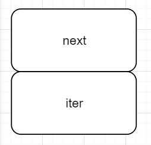
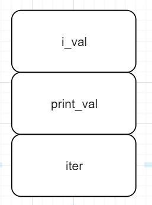
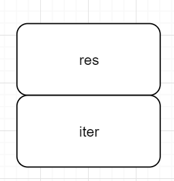

## 控制流——循环

### For循环

这部分会探索下虚拟机中的循环，Python代码如下：

```python
lst = [1, 2]

for i in lst:
    print(i)
```

字节码如下：

```shell
  1           0 LOAD_CONST               0 (1)
              2 LOAD_CONST               1 (2)
              4 BUILD_LIST               2
              6 STORE_NAME               0 (lst)

  3           8 SETUP_LOOP              20 (to 30)
             10 LOAD_NAME                0 (lst)
             12 GET_ITER
        >>   14 FOR_ITER                12 (to 28)
             16 STORE_NAME               1 (i)

  4          18 LOAD_NAME                2 (print)
             20 LOAD_NAME                1 (i)
             22 CALL_FUNCTION            1
             24 POP_TOP
             26 JUMP_ABSOLUTE           14
        >>   28 POP_BLOCK
        >>   30 LOAD_CONST               2 (None)
             32 RETURN_VALUE


```

##### SETUP_LOOP

`SETUP_LOOP`对应代码如下：

```c
	TARGET(SETUP_LOOP)
    TARGET(SETUP_EXCEPT)
    TARGET(SETUP_FINALLY) {
    /* NOTE: If you add any new block-setup opcodes that are not try/except/finally handlers, you may need to update the PyGen_NeedsFinalizing() function. */

    PyFrame_BlockSetup(f, opcode, INSTR_OFFSET() + oparg,
                       STACK_LEVEL());
    DISPATCH();
}
```

其中的`PyFrame_BlockSetup`代码如下：

```c
/* Block management */

void
PyFrame_BlockSetup(PyFrameObject *f, int type, int handler, int level)
{
    PyTryBlock *b;
    if (f->f_iblock >= CO_MAXBLOCKS)
        Py_FatalError("XXX block stack overflow");
    b = &f->f_blockstack[f->f_iblock++];
    b->b_type = type;
    b->b_level = level;
    b->b_handler = handler;
}
```

##### GET_ITER取出迭代器

在此后将我们要遍历的列表`lst`通过`LOAD_NAME`压入栈中，接下来的字节码是`GET_ITER`：

```c
TARGET(GET_ITER) {
    /* before: [obj]; after [getiter(obj)] */
    PyObject *iterable = TOP();
    PyObject *iter = PyObject_GetIter(iterable);
    Py_DECREF(iterable);
    SET_TOP(iter);
    if (iter == NULL)
        goto error;
    PREDICT(FOR_ITER);
    PREDICT(CALL_FUNCTION);
    DISPATCH();
}
```

首先取出列表`lst`，获取其迭代器`iter`，并通过`SET_TOP`将栈顶的列表换为迭代器。同样，这里跟`COMPARE_OP`一样使用了`PREDICT`。

##### 一次循环

继续看下一条字节码`FOR_ITER`：

```c
PREDICTED(FOR_ITER);
TARGET(FOR_ITER) {
    /* before: [iter]; after: [iter, iter()] *or* [] */
    PyObject *iter = TOP();
    PyObject *next = (*iter->ob_type->tp_iternext)(iter);
    /* ADDED BY SCH001 */
    printf("iter: %p, next: %p", iter, next);
    
    if (next != NULL) {
        PUSH(next);
        PREDICT(STORE_FAST);
        PREDICT(UNPACK_SEQUENCE);
        DISPATCH();
    }
    ...
}
```

此时栈内容如下：



我们在执行此段代码时打印`next`和`iter`的地址，结果如下：

```shell
>>> lst = [1,2]
>>> for i in lst:
...     print(i)
...

//打印结果
iter: 011E2498, next: 7ACD63581
iter: 011E2498, next: 7ACD63702
iter: 011E2498, next: 00000000
```

可以看到`iter`的地址在循环过程中是不变的（因为iter事实上是一个对象），`iter`内部的`next`指针则随之改变，遍历结束后变成了NULL指针。

回到字节码本身，这里当`next != NULL`即循环尚未结束时，会将`next`压栈，正如注释所说：

> /* before: [iter]; after: [iter, iter()] *or* [] */

此时栈顶为`next`，我们看看后续的字节码：

```shell
14 FOR_ITER                12 (to 28)
16 STORE_NAME               1 (i)

18 LOAD_NAME                2 (print)
20 LOAD_NAME                1 (i)
22 CALL_FUNCTION            1
24 POP_TOP
26 JUMP_ABSOLUTE           14
```

`FOR_ITER`之后首先将栈顶的next和名字i绑定起来（`STORE_NAME`，会执行一次`POP`弹出`next`），接着通过两个`LOAD_NAME`把函数`print`和参数`i`放在栈顶，此时栈内容(向上增长)如下：

  

反手一个`CALL_FUNCTION`：

```c
PREDICTED(CALL_FUNCTION);
        TARGET(CALL_FUNCTION) {
            PyObject **sp, *res;
            sp = stack_pointer;
            res = call_function(&sp, oparg, NULL);
            stack_pointer = sp;
            PUSH(res);
            if (res == NULL) {
                goto error;
            }
            DISPATCH();
        }
```

在`call_function`中获得结果后会执行栈的清理工作：

```c
	...
	/* Clear the stack of the function object. */
    while ((*pp_stack) > pfunc) {
        w = EXT_POP(*pp_stack);
        Py_DECREF(w);
    }
	...
```

函数返回后会将结果`res`（虽然可能不会用到这个返回值）压栈，此时栈内容如下：



下一个字节码为`POP_TOP`，就是把这个无用的返回值出栈，对应代码为：

```c
TARGET(POP_TOP) {
    PyObject *value = POP();
    Py_DECREF(value);
    FAST_DISPATCH();
}
```

这会栈里就还剩下一个`iter`，这正和`GET_ITER`执行后的栈是相同的，下一句字节码为：

```shell
26 JUMP_ABSOLUTE           14
```

地址14对应`FOR_ITER`，其实就是开始了下一次循环，一次循环对应的字节码为：

```shell
14 FOR_ITER                12 (to 28)
16 STORE_NAME               1 (i)

18 LOAD_NAME                2 (print)
20 LOAD_NAME                1 (i)
22 CALL_FUNCTION            1
24 POP_TOP
26 JUMP_ABSOLUTE           14
```

##### 终止循环

那么一次循环是如何结束的呢？道理很简单，当`next != NULL`不成立时，会执行如下代码：

```c
	...
	if (PyErr_Occurred()) {
        if (!PyErr_ExceptionMatches(PyExc_StopIteration))
            goto error;
        else if (tstate->c_tracefunc != NULL)
            call_exc_trace(tstate->c_tracefunc, tstate->c_traceobj, tstate, f);
        PyErr_Clear();
    }
    /* iterator ended normally */
    STACKADJ(-1);
    Py_DECREF(iter);
    JUMPBY(oparg);
    PREDICT(POP_BLOCK);
    DISPATCH();
}
```

这里的`oparg`参数就是`14 FOR_ITER                12 (to 28)`中的12，循环结束后执行的字节码就是地址28对应的：

```shell
28 POP_BLOCK
```

```c
PREDICTED(POP_BLOCK);
TARGET(POP_BLOCK) {
    PyTryBlock *b = PyFrame_BlockPop(f);
    UNWIND_BLOCK(b);
    DISPATCH();
}
```

这正是对应前面的`SETUP_LOOP`。