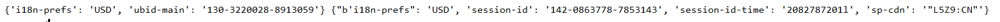
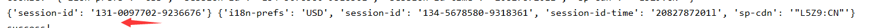

## Amazon电影爬虫小记

最近开始做数据仓库的课程项目，需要爬取接近25万条亚马逊上的电影数据，大概就是给定`product_id`（不一定是电影），爬取亚马逊上对应的页面。url大概长这样： https://www.amazon.com/dp/6301217888 ，`6301217888`是前面提到的`product_id`。

顺带一提，虽然最终希望拿到是关于电影的信息（比如Director、Actors等），因为页面解析的逻辑稍微有点复杂，所以我们的做法是先把整个`html`扒下来，然后把无关的信息比如`css`、脚本代码先删除掉，然后保存在本地，后续在本地再进行一波页面解析。

### 反反爬虫

爬虫这一块我基本没这么接触过，所以就看了点简单的库使用，用到的主要是`request`，`bs4`大概后面解析会用得稍微多一点。

数据量有点大，所以主要还是反“反爬虫”需要下功夫。我们采用的策略有以下三种：

- 代理IP

  这个是借了Github上的[这个项目]( https://github.com/jhao104/proxy_pool )在本地的`Redis`数据库维护了一个代理的IP池，还是挺给力的。

- User Agent

  python的`fake_useragent`，当然也可以自己收集一些`headers`。

- Cookies

  这算是反爬虫这个步骤个人参与的比较多的一部分，后面也会围绕这部分展开。另外，我觉得代理IP和User Agent在反爬中都是具有普适性的，cookies池这种相对而言可能稍微具体一点。

### 冷静分析

事实上就算你用了cookies、代理IP也会被`Robot Check`（输入验证码）或者Proxy Error一类的反爬虫措施蹂躏。一位不愿透露姓名的好心人沛哥给我们传授了一波经验，一个页面只要反复爬，遇到反爬措施就多请求几次，最后基本上都是可以拿到页面的。另外，他们是维护了一个小型的固定大小的cookies队列，有新cookies就扔掉老化的cookie。

这样一看，亚马逊对爬虫还是比较友好的。我从Chrome上粘下来一个cookies试了一下，头铁的确可以出奇迹。于是开始思考如何搭一个cookies池。

#### cookies池

借鉴[proxy_pool]( https://github.com/jhao104/proxy_pool )，我决定用本地的Redis充当存放cookies的地方。proxy_pool的逻辑大概就是爬完代理IP，然后扔进数据库里，再开一个RESTful的接口去供外部提供代理IP。考虑到数据库一般是在本地，所以我是用`CookiePool`类封装了redis的接口，向外提供cookies的插入、更新、删除等操作。

事实上证明这样的操作也是合理的，数据库相当于就是一个帮你处理各种并发请求的队列，省心高效。

#### cookies的更新策略

前面提到，带or不带cookies都可能被锤或者成功，成功的访问一般都会有cookies返回，你可以

```python
cookiejar = response.cookies
cookiedict = requests.utils.dict_from_cookiejar(cookiejar)
```

这样可以拿到一个字典形式的字典。

发与不发cookies我们借鉴了前面好心人的做法，有一定的概率不带cookies，这样就会有新的cookies补充。

##### cookies的格式

据我观察，首次请求拿到的cookies一般是这种格式：

```shell
i18n-prefs : USD 
session-id : 132-7872740-0358531 
session-id-time : 2082787201l 
sp-cdn : "L5Z9:CN" 
```

我斗胆做了一下猜测，`session-id`是一个可以标识cookies的字段（所以我用它作为数据库cookies表的key）。当不带cookies且请求成功时，把这个cookies扔进cookies池。

```python
 @staticmethod
    def cache_cookies(cookiedict):
        cookies_pool.get_all()
        cookies_pool.put(cookiedict['session-id'], cookiedict)
```


后面你拿着一个cookies去做请求，如果成功你会拿到新的cookies，一般会有以下几种形式：

- 返回一些我认为的无关紧要的字段（前面的是返回的cookies，后面是发过去的cookies）

  

  ```shell
  ubid-main 133-3832639-2346543 
  
  session-token ac7hD4pZPNFHeTO84/5mjShBijpi9pZ2ndWVI2VWjHqEK3KBydaqGllMsJDmPDWbQbUmxys06mr3fZSCmljj5H/CDtFrUY8OmpWPiQtPG19E/1Vjv4dwmX3F0zfP4iWpjiZhpC7OkFvTAney0VLYQfdh3lFwpW1e7iiGjL6SRetSpIFXgCdtcF55H6lxLTAs 
  ```

- 返回新的`session-id`，也就是和你request中带的`session-id`

  

想想一个正常的浏览器和server进行交互，客户端发cookies，接cookies然后更新，所以对于上述的两种情况：

- 无关紧要的字段，更新发过去的cookies中的字段，有时候会返回新的key，这时候强行加进去就行。
- `session-id`，我再次大胆猜测server端是想告诉我你这个cookies过期了，该换id了，于是我会把原来的cookies删除，用`session-id`代替原来的`session-id`，重新插入。

看起来好像都是更新字段，但是具体到数据库的层面，相当于我是拿`session-id`来做`Redis`的主键，所以更新操作略微有点不同。

```python
 	@staticmethod
    def update_cookies(cookiedict:dict, old_cookies:dict):
        # session_id = old_cookies['session-id']
        print('New Cookie: ', cookiedict)
        # 更新cookie池缓存
        cookies_pool.get_all()
        if 'session-id' in cookiedict:
            # 更新session-id
            # session_id = cookiedict['session-id']
            print('delete')

            cookies_pool.delete(old_cookies['session-id'])
            assert cookies_pool.get(old_cookies['session-id']) is None

            for key, val in cookiedict.items():
                old_cookies[key] = val
                Crawler.cache_cookies(old_cookies)
```


##### cookies的淘汰机制

正常猜想，cookies是会过期的，所以需要有一个简单的淘汰机制。这里是在爬取的时候维护一个字典，记录一个cookies**连续**失败请求的次数，当超过`Max_Cookies_Cnt`次时，会把这个cookies从数据库中删除。这里一开始我的淘汰机制比较宽松，一方面是觉得cookies来之不易，另一方面是请求失败事实上不一定是cookies的锅（代理IP、网络情况之类）。

后来发现cookies有暴涨的趋势，一度维持在1000个左右...数据分开后队友一开始爬取时比较快，后续速度放缓，猜想是cookies积累老化，所以淘汰机制残酷了一些，cookies维持在700左右。

### 爬取

单线程爬取比较之慢，自然要搬多线程。线程数变化：10->15。线程数为10和15时，一个线程爬取50个url，耗时都是30分钟不到。

后面改了淘汰机制，允许一个cookies最大连续失败次数：5->3->2，还有一个最大url连续失败次数：15->10，耗时：30分钟->20分钟

|cookies最大连续失败次数|最大url连续失败次数|15个线程（每个线程爬取50个页面）耗时|失败页面数：成功页面数（大致）|
|:---|:---:|:---:|:---:|
|15|3|30分钟|1:4|
|10|2|20分钟|1:3|

虽然网络因素也举足轻重，但在此基本忽略。最后的配置大概是：

| cookies最大连续失败次数 | 最大url连续失败次数 |  线程数  |
| :---------------------- | :-----------------: | :------: |
| 10                      |          2          | 16 |

虽然好像python的多线程是假的，但我猜测线程切换的开销还是可以忍受的（主要是懒得改--）。尝试过开20个线程，那次貌似整体速度提升不是很明显，于是作罢，可能是网络问题，找时间再试试。

最后，放下今天边摸🐟边配JavaEE环境偶尔爬数据的微薄成果：


### 收获

大约是体验了下反爬虫，Redis真香，面向对象（哦不强行封装）真香！